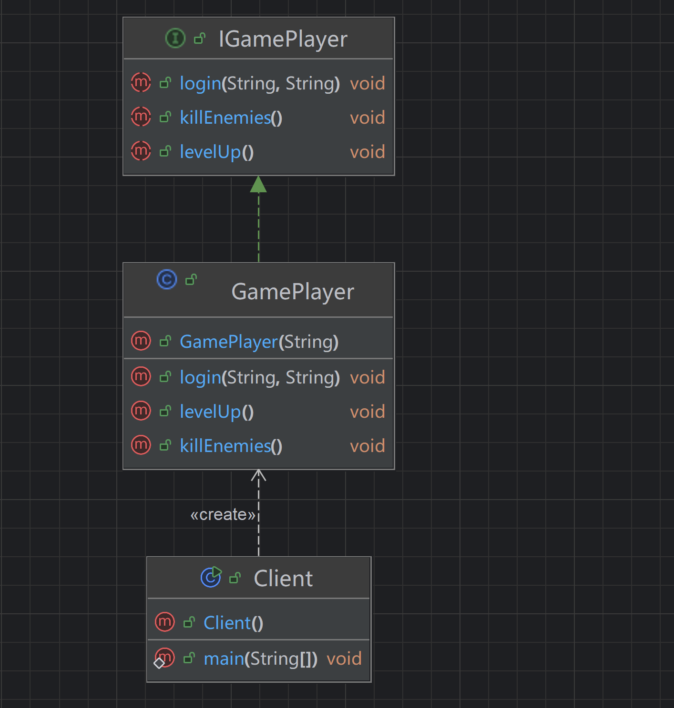

# Java动态代理

## 1.代理模式

代理（Proxy）是一种设计模式，它提供了对目标对象的简介访问方式。代理模式的核心思想是通过创建一个代理对象来间接访问实际对象，从而在不改变实际对象的前提下，对实际对象添加额外的功能或者访问控制。

抽象来讲是这么回事，我们知道在学习面向对象的时候我们经常把抽象的东西和实际的东西结合，那么对于代理来说也类似的，我们可以用一个很实际的例子来说明：

以购买房产为例。购房者（客户端）想要购买房产，房产所有者（真实主题）是实际出售房产的人。房产中介（代理）则代表房产所有者与购房者进行沟通和交易。购房者不需要直接和房产所有者打交道，而是通过房产中介来完成看房、议价等操作。房产中介可以在交易过程中添加一些额外的服务，如提供市场分析、协助办理手续等，这就相当于在真实主题的操作基础上添加了额外的逻辑。

## 2.代理模式作用

1. **保护代理**：代理可以为实际主题或者说实际对象提供一层保护，确保其不会被不受信任的第三方直接访问
2. **增强功能**：在程序中，需要给某个对象的功能进行功能增强的时候，可以考虑找一个代理进行增强，例如:Spring 框架中的 AOP 切面编程就是对代理模式的经典应用。
3. **代理交互**：在程序中，A对象无法和B对象直接交互时，也可以使用代理模式来解决。
4. **远程代理**：代理可以作为远程对象的本地代表，隐藏对象位于不同地址空间的事实，使得远程调用就像本地调用一样。

## 3.代理模式引入

这个部分看了很多博客文章，最后看下来还是《设计模式之禅》这本书这里讲的最好最细，所以我们这里用他的demo来进行学习。

我们前文中对于代理模式的现实对照用的是客户找中介买房主的房子，而这本书中举了一个更详尽更接地气的例子，打游戏，找代练（代肝），这里有兴趣的可以去看原文，我们跳过引入阶段直接用一个类关系图来说明代理模式。

我们先定义一个接口（interface）IGamePlayer（有关接口的知识忘了可以去复习前面的面向对象）：

```java
public interface IGamePlayer {
    //登陆游戏
    public void login(String user, String password);
    //刷怪
    public void killEnemies();
    //升级
    public void levelUp();
}
```

然后定义一个具体的实现类GamePlayer：

```java
public class GamePlayer implements IGamePlayer{
    private String name = "";
    public GamePlayer(String playerName){
        this.name = playerName;
    }
    @Override
    public void login(String user, String password) {
        System.out.println("登陆成功！欢迎玩家"+this.name);
    }

    @Override
    public void killEnemies() {
        System.out.println(this.name+"击杀了敌人！");
    }

    @Override
    public void levelUp() {
        System.out.println(this.name="等级提升！");
    }
}
```

再定义一个场景类来模拟玩家打游戏的过程：

```java
public class Client {
    public static void main(String[] args) {
        //定义一个玩家
        GamePlayer player = new GamePlayer("朱春娟");
        //玩家登录，随便写的账户密码
        player.login("Julia","passwd");
        //玩家刷怪
        player.killEnemies();
        //玩家升级
        player.levelUp();
    }
}

```

以上就可以看作我们一般打游戏的过程，我们上线，刷怪，升级，无数游戏，几十年来莫过于如此。我们知道，刷怪的过程是痛苦的，但到达某个等级或者是刷出某件装备时快乐也是无限的，由此也催生出了一种名为代练或者现在叫代肝的职业，帮助玩家们跳过痛苦直达极乐。

我们来定义一个代练类：

```java
public class GamePlayerProxy implements IGamePlayer{
    private IGamePlayer gamePlayer = null;
    //代练登录
    public GamePlayerProxy(IGamePlayer _gamePlayer){
        this.gamePlayer = _gamePlayer;
    }
    @Override
    public void login(String user, String password) {
        this.gamePlayer.login(user, password);
    }

    @Override
    public void killEnemies() {
        this.gamePlayer.killEnemies();
    }

    @Override
    public void levelUp() {
        this.gamePlayer.levelUp();
    }
}
```

代练的实现其实和正常的玩家没有什么区别，因为合法的代练也只是通过手打来帮你升级，通过以上这些Demo，我们便可以开始代理模式的学习。

最初，我们自己来练级刷怪，直接通过GamePlayer类来进行：



我们运行此时的Client类主方法，得到玩家朱春娟打怪升级的信息：


在请了代练以后，我们让代练登我们的号去刷怪练级，我们对Client类的代码稍作修改，让代练去执行刷怪练级的操作：

```jsx
public class Client {
    public static void main(String[] args) {
        //定义一个玩家
        GamePlayer player = new GamePlayer("朱春娟");
        //定义一个代练
        GamePlayerProxy proxy = new GamePlayerProxy(player);
        //代练登录，随便写的账户密码
        proxy.login("Julia","password");
        //代练刷怪
        proxy.killEnemies();
        //代练升级
        proxy.levelUp();
    }
}
```

此时代练的关系可以用这个类图表示：


我们再运行Client类，结果与之前并无区别，依然是朱春娟打怪升级，和代练的逻辑一样，是代练对玩家的账号去打怪升级：


这就是设计模式中的代理模式，即Client通过GamePlayerProxy去访问了Gameplayer，以上实现代理模式的方式也被称为静态代理，类似于面向对象中的多态，这种模式在实际的使用场景中存在着诸多不便，比如一旦接口或者父类发生了变动，则代理类的代码就得随之修改，代理类多的时候维护十分麻烦。

## 4.代理模式分类

Java中代理模式分为三种，分别为：**静态代理，JDK动态代理，CGLIB动态代理**

### 4.1.静态代理

即前文中实现代理的形式，在编译时就已经确定了代理类和目标类的关系，这里不做过多赘述，我们重点讲另外两种动态代理

### 4.2.动态代理

什么是动态代理呢？动态代理就是在实现阶段不用关心代理谁，而是在运行阶段才去指定代理的对象，而在Java中，实现动态代理的方式有两种：

### 4.2.1.JDK提供的动态代理接口

JDK提供了一个实现动态代理的接口`InvocationHandler`，用于对被代理类的方法进行管理，我们实现这个接口编写一个用于动态代理Gameplayer类的GameplayIH类：

```jsx
import java.lang.reflect.InvocationHandler;
import java.lang.reflect.Method;

public class GamePlayIH implements InvocationHandler {
    //被代理类
    Class<?> cls = null;
    //被代理类的实例化（对象）
    Object object =null;
    //构造方法中传入要代理的对象
    public GamePlayIH(Object obj) {
        this.object = obj;
    }
    //重写invoke返回执行方法的结果
    @Override
    public Object invoke(Object proxy, Method method, Object[] args) throws Throwable {
        return method.invoke(this.object,args);
    }
}
```

其实不难发现，通过实现InvocatioHandler接口来实现动态代理，本质上就是利用反射机制来实现代理模式，有关反射可以回头看看之前介绍反射的文章。即我们可以通过反射，在Java程序运行时动态地获取到一个类的Class对象，从而进一步获取到其构造方法，成员方法，成员变量等，而invoke方法也和反射中学到的一样，用于调用反射获取到的方法并返回原方法的返回值。而这些信息在代理模式实现时也恰好需要，故实际上动态代理，就是Java反射机制的应用。

我们来看看动态代理的场景下，游戏代练又应该如何实现，还是修改一下Client类：

```jsx
import java.lang.reflect.InvocationHandler;
import java.lang.reflect.Proxy;

public class Client {
    public static void main(String[] args) {
        //定义一个玩家
        GamePlayer player = new GamePlayer("朱春娟");
        //定义一个代练
        InvocationHandler handler = new GamePlayIH(player);
        //获取被代理类也就是玩家类的类加载器
        ClassLoader classLoader = player.getClass().getClassLoader();
        //利用反射创建动态代理对象
        IGamePlayer proxy =  (IGamePlayer) Proxy.newProxyInstance(classLoader, new Class[]{IGamePlayer.class}, handler);
        //代练登录，随便写的账户密码
        proxy.login("Julia","password");
        //代练刷怪
        proxy.killEnemies();
        //代练升级
        proxy.levelUp();
    }
}
```

以上代码运行结果如下：


这就是在我们描述的代练游戏这个场景中，最基本的利用JDK提供的接口实现动态代理的方式，前文中提到了动态代理可以实现保护代理，增强功能等功能，那这些作用有应该如何实现呢？

既然使用了代理模式，那我们当然不需要再去修改目标类，只需要在代理类中增加相关的逻辑代码。例如比较常见的防盗号功能，即登录之后发送给本人提示登录提醒（通常来讲这类功能都是在非常用登录地点时调用，还会附带很多诸如登录时间，登录地点等信息，但这里只是为了演示代理模式作用，故只做一个简单的输出提示），例如我们在编写动态代理类时重写invoke方法时，可以像下面这样：

```jsx
import java.lang.reflect.InvocationHandler;
import java.lang.reflect.Method;

public class GamePlayIH implements InvocationHandler {
    //被代理类
    Class<?> cls = null;
    //被代理类的实例化（对象）
    Object object =null;
    //构造方法中传入要代理的对象
    public GamePlayIH(Object obj) {
        this.object = obj;
    }
    @Override
    public Object invoke(Object proxy, Method method, Object[] args) throws Throwable {
        if (method.getName().equalsIgnoreCase("login")){
            System.out.println("您的账号在不常用地点登录，请确认是否您是否知情，如不知情请尽快修改账户密码");
        }
        return method.invoke(this.object,args);
    }
}
```

此时运行Client类，结果如下


我们看看此时的类图：


可以看到，我们并没有实现IGamePlayer接口，也没有创建代理类，但已经实现了代理模式，这就是动态代理。

上述的Demo中我们使用动态代理对目标类进行了功能增强，即增加了登录提示的功能。我们不妨思考一下，在一个企业级的应用中，动态代理能够实现什么样的作用？

我们是否可以将较为重复且繁杂的日志记录，安全检查（例如鉴权），事务管理等这些功能都交由动态代理来实现，而在开发设计阶段只关注核心业务逻辑呢？

而贯彻这一思路衍生出的编程范式，我们现在称之为面向切面编程（Aspect - Oriented Programming，AOP），这里简单介绍一下AOP的核心要素：

- **切面（Aspect）**：切面是一个模块化的单元，它封装了横切关注点的实现。可以将切面看作是一个包含了建议（Advice）和切点（Pointcut）的组合。例如，一个日志记录切面包含了记录日志的建议（如在方法执行前、执行后记录什么内容）以及定义在哪些方法（切点）上应用这个日志记录。
- **建议（Advice）**：建议定义了在切面中的具体行为，也就是在什么时候（如方法调用前、调用后、抛出异常时）执行横切关注点的代码。主要有以下几种类型：
    - **前置建议（Before Advice）**：在目标方法调用之前执行的代码。例如，在用户登录方法之前进行身份验证的代码就是前置建议。
    - **后置建议（After Advice）**：在目标方法正常完成调用后执行的代码。比如在订单处理完成后记录处理结果的日志。
    - **返回建议（After - Returning Advice）**：在目标方法成功返回结果后执行，并且可以访问方法的返回值，用于对返回值进行处理或记录。
    - **异常建议（After - Throwing Advice）**：当目标方法抛出异常时执行，用于处理异常情况，如记录异常信息。
    - **环绕建议（Around Advice）**：它可以在目标方法调用前后都执行代码，是最灵活的一种建议类型。可以完全控制目标方法的执行，包括决定是否执行目标方法、修改方法参数、修改返回值等。
- **切点（Pointcut）**：切点用于定义在哪些连接点（Join Point）上应用切面。连接点是程序执行过程中的一些特定的点，如方法调用、方法执行、对象初始化等。切点可以通过表达式或者其他方式来指定在哪些类的哪些方法上应用切面。例如，一个切点可以定义为 “com.example.service 包下所有类的所有公共方法”。
- 在 Java 中，AOP 框架（如 AspectJ、Spring AOP）会在编译期（AspectJ 可以在编译期进行字节码编织）或者运行期（Spring AOP 主要是在运行期通过动态代理实现）对目标对象的字节码进行修改或者创建代理对象，使得在目标方法的执行过程中能够按照定义的切面、建议和切点来执行横切关注点的代码。

### 4.2.2.基于CGLIB的动态代理

- **原理**：CGLIB（Code Generation Library）是一个强大的字节码生成库，它通过在运行时动态生成字节码来创建代理类，用于实现动态代理功能。与 Java 原生的基于接口的动态代理（通过 `java.lang.reflect.Proxy` 实现，要求被代理的类必须实现接口）不同，CGLIB 可以对没有实现接口的普通类进行代理，它是通过继承被代理的目标类，重写其中的方法来实现代理逻辑的添加。
- **应用场景**：当需要代理的类没有实现接口，或者希望基于类的继承体系来更灵活地实现代理逻辑时，CGLIB 动态代理就可以发挥作用。例如，在一些框架中对特定的业务类进行功能增强，添加诸如性能统计、方法调用拦截等功能，即便这些业务类没有接口也能通过 CGLIB 来实现代理。

以下是一个使用 CGLIB 实现动态代理的简单Demo，假设我们有一个简单的业务类，没有实现任何接口，我们要对其方法调用进行拦截并添加额外的逻辑：

我们首先引入CGLIB相关的依赖，以Maven项目为例，pom.xml中添加如下依赖：

```xml
<dependency>
	<groupId>cglib</groupId>
	<artifactId>cglib</artifactId>
	<version>3.3.0</version>
</dependency>
```

随后创建一个被代理类，代理类中包含一个最简单的业务方法sayHello：

```java
public class HelloService {
    public String sayHello(String name) {
        return "Hello, " + name;
    }
}
```

然后编写一个代理类，这个代理类实现自cglib包中的`MethodInterceptor` 接口，关于这个接口的说明我们放在代码demo演示之后：

```java
package org.example;

import net.sf.cglib.proxy.Enhancer;
import net.sf.cglib.proxy.MethodInterceptor;
import net.sf.cglib.proxy.MethodProxy;

import java.lang.reflect.Method;

public class HelloServiceProxy implements MethodInterceptor {

    //用于获取代理对象
    public Object getProxy(Class<?> clazz) {
        Enhancer enhancer = new Enhancer();
        enhancer.setSuperclass(clazz);
        enhancer.setCallback(this);
        return enhancer.create();
    }

    //简单模拟代理模式的前置建议后置建议执行过程
    @Override
    public Object intercept(Object obj, Method method, Object[] args, MethodProxy methodProxy) throws Throwable {
        System.out.println("Before method call");
        Object result = methodProxy.invokeSuper(obj, args);
        System.out.println("After method call");
        return result;
    }
}
```

我们简单解释一下里面一些关键的方法：

- **`Enhancer` 类的使用**：`Enhancer` 是 CGLIB 中用于创建代理对象的核心类。在 `getProxy` 方法中，首先创建了一个 `Enhancer` 实例，然后通过 `enhancer.setSuperclass(clazz)` 设置要代理的目标类（也就是被代理类作为父类，代理类会继承它），接着使用 `enhancer.setCallback(this)` 将当前实现了 `MethodInterceptor` 接口的实例（也就是自身）作为回调，用于拦截目标类方法的调用并添加额外逻辑。最后通过 `enhancer.create()` 方法创建并返回代理对象。
- **`intercept` 方法（实现 `MethodInterceptor` 接口的关键方法）**：
    - 当通过代理对象调用目标类的任何方法时，都会进入到这个 `intercept` 方法中。
    - `System.out.println("Before method call");` 这行代码在方法调用前添加了一个简单的日志输出，模拟前置的额外逻辑，比如可以在这里进行权限验证等操作。
    - `Object result = methodProxy.invokeSuper(obj, args);` 这行调用了目标类的真实方法，通过 `methodProxy`（它是 CGLIB 提供的用于调用父类方法的对象）的 `invokeSuper` 方法，传入代理对象本身（`obj`）以及方法的参数（`args`）来执行目标类被调用的方法，并获取返回结果。
    - `System.out.println("After method call");` 则是在目标方法调用后添加了日志输出，模拟后置的额外逻辑，例如可以在这里进行结果记录等操作。最后将方法执行的结果返回。

接着我们模拟一个使用代理模式的场景，在Main Class中编写如下代码：

```java
public class Main {
    public static void main(String[] args) {
        HelloServiceProxy proxy = new HelloServiceProxy();
        HelloService helloServiceProxy = (HelloService) proxy.getProxy(HelloService.class);
        String result = helloServiceProxy.sayHello("John");
        System.out.println("Result: " + result);
    }
}
```

运行结果如下：


在这个场景中，我们首先创建了 `HelloServiceProxy` 实例，然后通过它的 `getProxy` 方法获取 `HelloService` 类的代理对象。接着使用代理对象调用 `sayHello` 方法，此时会触发代理类中 `intercept` 方法里的逻辑，在方法调用前后添加额外的日志输出，最后打印出方法调用的真实结果。可以看到，通过 CGLIB 动态代理成功对没有接口的 `HelloService` 类实现了代理，并在其方法调用前后添加了额外的逻辑，实现了类似面向切面编程中对方法调用的拦截和增强功能。

## 5.小结

（以下结果来自AI，信不信随缘，主要是为了收个尾不显得太突兀）

动态代理在Java代码审计学习中有着极为重要的作用，包括但不限于：

1. **理解程序执行流程**
    - **动态代理的调用过程**：在 Java 中，动态代理涉及到生成代理对象，通过代理对象调用目标方法时会经过一系列的拦截和处理逻辑。学习动态代理可以让你清楚地了解方法调用是如何被重定向和处理的。例如，在 Java 反射机制下的动态代理（使用`java.lang.reflect.Proxy`），当调用代理对象的方法时，实际上是调用了`InvocationHandler`接口的`invoke`方法。这种间接的调用方式有助于理解代码的执行路径可能不是表面上看到的那样直接，在代码审计中可以更好地追踪方法的真实调用逻辑。
    - **对程序运行时的监控**：通过动态代理可以在不修改原始业务逻辑代码的基础上，添加一些用于监控程序运行的代码。比如，在代理对象的方法调用前后记录日志，包括方法名称、参数、调用时间等信息。在代码审计时，这些日志信息能够帮助你还原程序的执行顺序，发现潜在的异常或者不符合预期的方法调用顺序，尤其是在复杂的业务逻辑和多层嵌套的方法调用场景下。
2. **发现安全漏洞和风险点**
    - **权限验证的检查**：动态代理可以用于实现权限验证逻辑。在代码审计过程中，通过检查代理对象中权限验证部分的代码（如在代理方法调用前检查用户是否具有足够的权限来执行该操作），可以发现权限验证是否存在漏洞。例如，如果权限验证逻辑被绕过，可能会导致未经授权的用户访问敏感信息或者执行关键操作。通过动态代理的拦截机制，能够更清晰地梳理出权限验证的流程，从而发现其中可能存在的安全风险。
    - **输入验证和数据安全**：在代理方法中，可以添加对输入参数的验证逻辑。这对于防止诸如 SQL 注入、命令注入等安全漏洞非常重要。例如，在代理对象拦截数据库操作方法时，检查传入的 SQL 语句参数是否经过正确的过滤和转义，确保不会因为恶意输入而导致安全问题。如果发现动态代理没有对输入参数进行有效的验证，这可能是一个潜在的安全风险点。
3. **代码复用和框架理解**
    - **框架中的代理模式应用**：许多 Java 框架广泛使用动态代理来实现各种功能。例如，在 Spring 框架的 AOP（Aspect - Oriented Programming）实现中，动态代理是一个关键技术。通过学习动态代理，能够更好地理解框架如何利用它来实现诸如事务管理、日志记录等横切关注点的功能。在代码审计时，了解框架的这种实现方式可以帮助你更快地定位到与这些功能相关的代码部分，检查其是否正确实现，是否存在可能被攻击者利用的漏洞。
    - **代码复用和维护角度**：从代码复用的角度看，动态代理可以将一些通用的功能（如日志记录、性能统计）封装起来，在多个不同的业务模块中复用。在代码审计过程中，这种复用的代码模式可能会影响到漏洞的传播范围。如果动态代理中的日志记录功能存在漏洞（如日志信息泄露），那么所有使用该代理的业务模块都可能受到影响。因此，理解动态代理的代码复用机制有助于评估漏洞的影响范围和严重性。
4. **挖掘隐藏的业务逻辑和恶意代码**
    - **隐藏逻辑的揭示**：动态代理可以用于隐藏部分业务逻辑。例如，一些复杂的业务系统可能会通过动态代理在运行时动态地加载和执行某些功能，这些功能可能不会在原始的代码结构中明显体现出来。在代码审计过程中，发现并分析动态代理相关的代码可以帮助你挖掘这些隐藏的业务逻辑，确保它们符合安全和业务需求。
    - **恶意代码注入检测**：如果系统被恶意攻击者入侵，攻击者可能会利用动态代理机制注入恶意代码。通过对动态代理代码的仔细审计，包括检查代理类的生成方式、`InvocationHandler`（或 CGLIB 中的`MethodInterceptor`）接口的实现逻辑等，可以发现是否存在异常的代码注入行为，如在代理方法调用过程中执行了一些非预期的外部命令或者非法的数据传输操作。

参考链接：[Java 设计模式-代理模式_java代理模式-CSDN博客](https://blog.csdn.net/weixin_39865508/article/details/141924680)

设计模式之禅：第十二章 代理模式