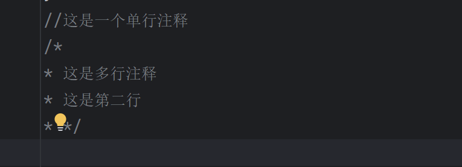

# Java基础语法

## 1.基础程序结构

一个最基本的Java代码程序组成大致如下：

```java
public class Main {
    public static void main(String[] args) {
        System.out.print("Hello and welcome!");
        }
}
```

从这里可以延伸一些东西：

### 1.1.修饰符

参考：[Java 修饰符 | 菜鸟教程 (runoob.com)](https://www.runoob.com/java/java-modifier-types.html)

代码中的public，static皆是，用于解释类和类中方法，如public用于访问控制，修饰符按照功能主要分为两种：

- 访问修饰符
- 非访问修饰符

访问修饰符主要用于类，方法，变量以及构造方法的访问控制，主要有以下几种

- **default** (即默认，什么也不写）: 在同一包内可见，不使用任何修饰符。使用对象：类、接口、变量、方法。
- **private** : 在同一类内可见。使用对象：变量、方法。 **注意：不能修饰类（外部类）**
- **public** : 对所有类可见。使用对象：类、接口、变量、方法
- **protected** : 对同一包内的类和所有子类可见。使用对象：变量、方法。 **注意：不能修饰类（外部类）**。

这里理解起来可能会有些抽象，但是后续学习面向对象的时候会很常用到这些修饰符，也就能够进一步理解访问控制的含义了

而非访问修饰符主要分为以下几种：

- static 修饰符，用来修饰类方法和类变量。
- final 修饰符，用来修饰类、方法和变量，final 修饰的类不能够被继承，修饰的方法不能被继承类重新定义，修饰的变量为常量，是不可修改的。
- abstract 修饰符，用来创建抽象类和抽象方法。
- synchronized 和 volatile 修饰符，主要用于线程的编程。

### 1.2.基本语法注意事项

- **大小写敏感**：Java 是大小写敏感的，这就意味着标识符 Hello 与 hello 是不同的。
- **类名**：对于所有的类来说，类名的首字母应该大写。如果类名由若干单词组成，那么每个单词的首字母应该大写，例如 **MyFirstJavaClass** 。
- **方法名**：所有的方法名都应该以小写字母开头。如果方法名含有若干单词，则后面的每个单词首字母大写。
- **源文件名**：源文件名必须和类名相同。当保存文件的时候，你应该使用类名作为文件名保存（切记 Java 是大小写敏感的），文件名的后缀为 **.java**。（如果文件名和类名不相同则会导致编译错误）。
- **主方法入口**：所有的 Java 程序由 **public static void main(String[] args)** 方法开始执行。

除此之外，基本语法一般还需要注意以下

### 1.3.注释

- 单行注释: `//注释文字`
- 多行注释: `/* 注释文字 */`
    - eclipse中，输入`/*`之后直接回车即可显示多行注释，并且光标定位在可输入注释位置。
- 文档注释: `/** 注释文字 */`
- 注释的作用: 解释说明程序，提高程序的阅读性
- 注释的嵌套：
    - 单行可以相互嵌套，多行可以嵌套单行，多行不可嵌套多行。

idea中演示一下



```java
//这是一个单行注释
/*
* 这是多行注释
* 这是第二行
* */
```

### 1.4.关键字

- 关键字：被Java语言赋予特定含义的单词
- 关键字特点：
    - 全部小写；
    - 常见的代码编辑器会对关键字有特殊的颜色标记。
    - 熟悉常见关键字，可以会考查：
        - 数据类型，数据类型值，修饰符，类类关系，实例相关，异常处理，包等。

### 1.5.标识符

- 作用：包,类,方法,变量等的命名
- 组成规则
    - 由字符(字母汉字数字)，下划线_，美元符$组成
        - 字符：unicode字符集，包括英文大小写字母，中文字符，数字字符等；不建议使用中文字符。
    - 不能以数字开头(美元符号、下划线都可以)；
    - 不能是Java中的关键字。
- 命名规则：见名知意
    - 包(文件夹) ：全部小写，多级包用点隔开。xxxyyyzzz，com.itheima。
    - 类：每个单词首字母大写。XxxYyyZzz。
    - 变量或者方法：第一个单词首字母小写，从第二个单词开始每个单词首字母大写。xxxYyyZzz。
- java源码命名：java文件名应与代码中public类的名字相同。

### 1.6.常量

- 常量：在程序执行的过程中，其值不可以发生改变的量。
- 常量分类：
    - 字符串常量("")；整数常量；小数常量；字符常量('')；布尔常量(true和false)；空常量(null)。

### 1.7.变量

- 变量概述：在程序执行的过程中，在某个范围内其值可以发生改变的量
    - 本质讲：变量是内存中的一小块区域。(配合图示食用)
    - 区域限定：用数据类型限定 (eg. 苹果的价格是数字，不能是字符串..)
    - 区域名称：变量名。
    - 区域内容：初始化值。
- 变量定义格式：
    - `数据类型 变量名 = 初始化值;`
    - `数据类型 变量名; 变量名 = 初始化值;`
- 变量定义的注意事项：
    - 变量未赋值，不能直接使用；(否则会报错’未初始化‘)
    - 注意精度：定义long型或float型需要在数字末尾加L或F标记；
    - 注意范围：变量只在所属范围内有效，范围用大括号划分(代码块)；
    - 同一范围内，变量名不能重复；
    - 同一行可以定义多个变量，但是不建议 (看起来更清楚一些)。

## 2.基本数据类型

在讲解基本数据类型之前，我们先了解了解计算机基本存储单元，以便后续了解各个数据类型占用的存储

- 变量是内存中的小容器，用来存储数据。
- 计算机存储设备的最小信息单元叫“位（bit）”，又称“比特位”，通常用小写的字母b表示。
- 计算机最小的存储单元叫“字节（byte）”，通常用大写字母B表示，字节是由连续的8个位组成。
- 除了字节外的一些常用的存储单位：1024进率 (特殊: 1B=8bit)
    - bit-B-KB-MB-GB-TB-...

### 2.1.数据类型

首先明确Java是强数据类型的语言，类似C和C++，即对变量的使用必须申明数据类型，必须严格按照数据类型赋值；

对于不同的变量，java会对其分配不同的存储空间，这一点和C也是一样的。

这里插一句什么是弱数据类型的语言，弱数据不是没有数据类型，只是通常不需要开发者自己申明，使用时语言会根据使用者对其赋值自动分配数据类型，如Python，JavaScript等

常见数据类型如下：

- 基本数据类型：4类8种
    - 整数：byte-1，short-2，int-4，long-8；
    - 浮点数：float-4，double-8；
    - 字符：char-2；
    - 布尔：boolean-1；
    - 注：数字表示所占字节数
- 引用数据类型：类，数组，接口。
- 整数默认int型，浮点数默认double型。
- long类型定义时在数字末尾加L，float类型定义时在数字末尾加F(可小写，建议大写，更清晰)。
    - 否则会报错：整数不加L默认int类型，会报错’过大的整数‘；float不加F默认double类型，会报错’可能损失精度‘。

### 2.2.数据类型转换

- 隐式转换/默认转换：
    - 一般由小到大
    - 运算时，存在更高级类型则自动提升：byte,short,char—>int—>long—>float—>double
    - byte,short,char相互之间不转换，他们参与运算首先转换为int类型
    - boolean类型不能转换为其他的数据类型
- 显式转换/强制转换：
    - 一般由大到小；可能会损失精度。
    - 格式：`目标类型 变量名=(目标类型)(被转换的数据);`
    - 例如：`byte d = (byte)(a+b);`
    - 建议：数据做运算，结果应该是什么类型就用什么类型接受，不要随意转换类型，否则会有精度的损失 。

## 3.运算符

### 3.1.定义

- 运算符：对常量和变量进行操作的符号称为运算符.
- 表达式：用运算符把常量或者变量连接起来符合java语法的式子就可以称为表达式。
    - 不同运算符连接的式子体现的是不同类型的表达式。

### 3.2.算术运算符

- 加减乘除 `+,-,*,/` ：
    - 加减乘正常；
    - 除法：注意int相除只能得到int，要想得到小数，就必须有浮点型参与运算。
- 取余 `%`：
    - 整除的余数；
    - 应用1：对2取余结果为0或1，可以实现开关算法切换；
    - 应用2：任何数对某数取余，结果必小于被取余数，可以实现将结果控制在某数范围内。
- 取模与取余：
    - Java中取余和取模是不同的，取余是`%`，而取模是`Math.FloorMod()`; c和c++中取模为`%`，而Python中取模为`%`。
    - 取余，遵循尽可能让商向0靠近的原则; 取模，遵循尽可能让商向负无穷靠近的原则(fix()和floor()两个函数的不同)
    - 当a b同正负，则结果一致；当a和b不同正负，则取余结果正负同a，取模结果正负同b。
    - 示例：
        - `7 % 4 = 3`, `Math.FloorMod(7,4)=3`;
        - `(-7) % (-4) = -3`, `Math.FloorMod(-7,-4) = -3`.
        - `7 % (-4) = 3`, `Math.floorMod(7, -4) = -1`;
        - `(-7) % 4 = -3`, `Math.floorMod(-7, 4) = 1`.
        - 注：7 % (-4) = (-4)(-1)+3, 而 Math.FloorMod(7,-4) = (-4)(-2)+(-1)
    - 参考链接：[Java取模和取余，你真的弄懂了吗？](https://www.cnblogs.com/doondo/p/14678204.html)（不是很重要，选择看）
- 加号 `+`：
    - 数值变量相加是加法运算。
    - 字符参与加法运算：字符在计算机中存储的数据值（ASCII码）来参与运算；
        - 常见字符值：`A-65`,`a-97`, `0-48`
    - 字符串参与加法运算：和其他类型的数据做拼接，结果是字符串类型的。
    - 示例：
        - 设置`int a = 10, b = 20;`
        - 则`打印("hello" + a)`，结果是`hello10`，直接拼接；
        - 则`打印("hello" + a + b)`，结果是`hello1020`，直接拼接；
        - 则`打印(a + b + "hello")`，结果是`30hello`，从左往右，先计算后拼接。
- 自增自减 `++--`：
    - `++--`可以放在变量的左侧或者右侧，均可。
    - 单独使用时，放在左右，结果没有区别；
    - 参与其他运算时：
        - `a++`：先拿变量做操作运算，后变量自增自减；
            - 注：内存表示中，(b=a++为例) 会先取出变量初始值存起来，然后进行运算即a+=1，然后把存起来的初始值赋值给b。
        - `++a`: 先变量自增自减，后拿变量做操作运算。
        - 注：简单记忆为”谁(指变量或加加减减)在前先操作谁“ eg. ，变量在前运算后自增自减，符号在前先自增自减。

### 3.3.赋值运算符

- 基本赋值运算符：`=`
    - 与逻辑运算符等等于`==`区别。
- 扩展赋值运算符：`+=, -=, *=, /=,...`
    - 注意：此类运算符隐含强制类型转换，<即强制转换为左侧的数据类型>。(潜在考点，可能见于笔试小题)
    - 示例：`byte a;`时：`a+=10;`相当于`a=(a的数据类型)(a+10);`，但`a=a+10`就可能因为数据类型不一致而报错。
- 关系运算符
    - 符号包含：`==,!=,>,>=,<,<=`
    - 结果类型：关系运算符的结果都是boolean型，true或false。
    - 注意：关系运算符“==”不能误写成“=” 。
        - `输出(a==b)`: 判断a与b是否相等，然后输出比较结果。
        - `输出(a=b)`: 把b的值赋值给a，然后将a的值输出。
        - 注意：如果在布尔型变量位置出现`a=b`，要知道此处的结果。
- 逻辑运算符
    - 逻辑运算符用于连接关系表达式
        - 注意：在Java中不可以写成`3<x<6`，应该写成`x>3 && x<6`。
    - 符号包含：`&,|,^,!,&&,||`
        - 与运算`&`：一假即假，全真才真。
        - 或运算`|`：一真即真，全假才假。
        - 异或运算`^`：相同为假，不同为真。(异或即求异)
        - 非运算`!`：只连接一个，转为反面 (注：!!可两个以上相连使用不会报错)。
    - 短路：双与双或
        - 结果与"单与"和"单或"一样。
        - `&`：两边都参与运算；`&&`：左为false时，右边不执行。
        - `|`：两边都参与运算；`||`：左为true时，右边不执行。
    - 示例：
        
        ```
        int a = 10, b = 20;
        System.out.println((a++ > 10) && (b++ > 20));//先算a与10的比较，后a++，不成立则短路，false
        System.out.println(a);//a=11
        System.out.println(b);//b=20 短路未执行，因此不变
        ```
        
- 三元运算符
    - 格式：`(关系表达式)?表达式1：表达式2；`
        - 如果条件为true，运算后的结果是表达式1；
        - 如果条件为false，运算后的结果是表达式2；
    - 获取两个数中大数：
        - `z = (x>y)?x:y;//z变量存储的就是两个数的大数。`
    - 比较两个整数是否相同：
        - `boolean b = (a==b) ? true : false;`
        - `boolean b = (a==b); //其实这样写就可以了，上一行是为了演示三元运算符`
    - 获取三个数中的最大值：
        
        ```
        int temp = (a>b) ? a: b;
        int max = (temp>c) ? temp: c;
        ```
        
- 位运算符
    - 左移和右移：
        - 左移：二进制位向左移动，相当于乘以2的次幂运算，移动几位就是几次幂。
        - 右移：二进制位向右移动，相当于除以2的次幂运算，移动几位就是几次幂。（整除）
        - 好处：运算速度快；弊端：只能操作2的倍数。
    - 右移和无符号右移：
        - 右移：最高位补位原则是，原最高位是什么，就补什么；
        - 无符号右移：空位补0。
        - 无符号右移：不用于做除法，用于获取二进制中的某些位。
    - 与`&`、或`|`：同逻辑运算符的位运算。
    - 异或`^`：位相同取1，不同取0。
        - 性质：`a^b^b=a;`，可以用于简单加密。
    - 反码`~`：二进制的每一位，0变成1，1变成0
        - 当n为正数时，`~(n) = -(n+1)`
        - 当n为负数时，`~(-n) = |n| - 1`，忽略负号。
        - 例如：`~6+1 = -6;`，`~(-3) = 2`
    - 经典面试题：两个整数互换
        - 三种方法：通过第三方变量；通过和；通过异或。
        - 第三方：`temp = a; a = b; b = temp`
        - 通过和(可能超出范围，慎用)：`a = a+b; b = a-b; a = a-b; //和-自己=另一个数`
        - 通过异或：`a=a^b; b=a^b; a=a^b; //a^b^b=a`
            - `a=a^b;`
            - `b=a^b=(a^b)^b=a;`
            - `a=a^b=(a^b)^a=(b^a)^a=b;` (根据两数异或的原理，可知交换律符合，故可得)
- [运算符优先级](https://www.cnblogs.com/anliux/p/12342676.html)
    - 括号>符号>乘除加减>位移>逻辑大于小于>逻辑等等于>与或非>双与双非>三目>赋值(=、某=)

## 4.程序流程控制

### 4.1.选择控制语句（分支结构）

- **if语句**
大致分为三种：
if用于单个判断

```java
int a = scanner.nextInt();
        if (a == 1)
            System.out.println("input 1");
```

if else用于多种不互斥条件以及与其他条件都互斥的另一条件判断，例如：

```java
 int a = scanner.nextInt();
        if (a == 1)
            System.out.println("input 1");
        if (a != 0)
            System.out.println("input is not zero");
        else
            System.out.println("input 0");
```

上述代码只有在输入0时会进入else的分支

if与else if和else连用，用于判断多个互斥互斥条件的分支控制，进入其中一个分支后，便不会进入其后的其他分支，例如：

```java
Scanner scanner = new Scanner(System.in);
        int a = scanner.nextInt();
        if (a != 0)
            System.out.println("input is"+a);
        else if (a == 0)
            System.out.println("input is 0");
        else if (a > 0 )
            System.out.println("input more than 0");
        else
            System.out.println("default");
```

例如我们输入2，程序只会进入第一个分支不会进入第三个分支，
同样的判断条件如果用多个if，就可以进入多个分支


- **switch case语句
关键字：**switch，case，default，break。
示例，与上述相同的if判断，可以改写为

```java
//这个demo写的比较弱智，用于理解，不必太过认真
int a = scanner.nextInt();
        switch (a){
            case 1:
                System.out.println("input is 1");
                break;
            case 2:
                System.out.println("input is 2");
                break;
            case 3:
                System.out.println("input is 3");
                break;
        }
```

注意事项：
表达式的取值：byte,short,int,char, JDK5以后可以是枚举, JDK7以后可以是String；
case后面的值：要与switch中的表达式进行对比的值，switch case结构的好处在于去除了重复取值，不存在进入多个分支的可能性，当然也就意味着通用性没有那么好

### 4.2.循环结构

- **for语句**

示例：

```java
for (int i = 0;i < 10;i++){
            System.out.println("这是第"+i+"轮");
        }
```

看看demo就懂了，无须多盐

- **while语句**

```java
int i = 0;
        while(i<10){
            System.out.println("this is "+i);
            i++;
        }
```

- **do…while语句**

```java
int i = 0;
        do {
            System.out.println("this is "+i);
            i++;
        }
        while(i<10);
```

注意：do…while和while的区别在于，前者即使表达式不符合，也会执行一次循环体内的语句，而后者不会，比如上述两个demo中的i都取值11，while不会输出，而do…while会输出this is 11，当然，for循环也是只有符合判断条件才会进入循环体，简单的可以按照代码顺序执行来理解。

- **break和continue**

break：用于循环体执行中，中断本次循环并不在进入下一次循环，示例：

```java
int i = 0;
        while(i<10){
            System.out.println("this is "+i);
            i++;
            if(i == 5)
                break;
            System.out.println("stop?");
        }
        System.out.println("stopped.");
```

这个代码只会循环到5，不会往后继续，输出结果为


同时讲讲continue，与break不同在于，continue只会结束当前这个循环，中断循环体之后的代码执行，此后仍会进入下一次循环，示例：

```java
int i = 0;
        for(i=0;i<10;i++){
            if (i == 3)
                continue;
            System.out.println("this is "+i);
        }
```

这个循环中，会跳过i为3时的那一次输出，输出为：


（这玩意儿少用）

注意：break和continue如果单独存在，该条语句下面都不可以有语句(永远执行不到的废物语句，会报错)

## 5.数组

### 5.1.一维数组

- 概述：
    - 数组是存储同一种数据类型多个元素的容器。
    - 数组既可以存储基本数据类型，也可以存储引用数据类型。
- 特点注意：
    - 元素类型必须一致；
    - 元素有整数索引；
    - 长度一旦定义好就无法改变；
    - 可以存储基本数据类型，也可存储引用数据类型。
- 定义数组：
    - 格式1：`数据类型[] 数组名;` -- 推荐使用
    - 格式2：`数据类型 数组名[];`
    - 注意：这两种定义做完了，数组中是没有元素值的。需要初始化。
- 数组的初始化：
    - 定义：为数组中的数组元素分配内存空间，并为每个数组元素赋值。
    - 分类：
        - 动态初始化：初始化时只指定数组长度，由系统为数组分配初始值(默认初始化)。
        - 静态初始化：初始化时指定每个数组元素的初始值，由系统决定数组长度。
    - 动态初始化：
        - 格式：`数据类型[] 数组名 = new 数据类型[数组长度];`
            - new：为数组申请内存分配，开辟空间。
    - 未指定数组元素时，通过数值名输出地址值，例如打印arr输出 `[I@15db9742`
    - 地址值 `[I@15db9742` ： 一个方括号表示一维数组，I表示int型，`@`是分隔符，后面是哈希值。
    - 访问数组元素：使用索引值。例如`arr[i]`。
    - 静态初始化：
        - 格式：`数据类型[] 数组名 = new 数据类型[]{元素1,元素2,…};`
            - 注意后面小括号不定义数组长度，以免不一致造成不确定性。
        - 简写：`数据类型[] 数组名 = {元素1,元素2,…};`，例如：`int[] arr = {1,2,3};`
    - 数组属性：length -- 获取数组中元素的个数。
        - 使用：`数组名.length;`
    - 数组获取最值的思路：
        - 注意：参照物从数组元素中取，否则容易出现取太大超过所有数组元素的情况。

### 5.2.二维数组

- 概述：二维数组其实就是元素为一维数组的数组。
- 定义格式：
    - `数据类型[][] 数组名;` -- 推荐
    - `数据类型 数组名[][];` -- 不推荐
    - `数据类型[] 数组名[];` -- 不推荐
- 初始化方式：
    - 动态初始化：`数据类型[][] 变量名 = new 数据类型[m][n];`
        - m：二维数组中的一维数组的个数，n：一维数组的元素个数。
    - 静态初始化：`数据类型[][] 变量名 = new 数据类型[][]{{元素…},{元素…},{元素…}};`
        - 简化版格式：`数据类型[][] 变量名 = {{元素…},{元素…},{元素…}};`
- 二维数组名+索引：获取一维数组地址名
    - 例如：arr[][]={{},{},..,{}};
    - `syso(arr);` -- 二维数组地址值：例如`[[I@6d06d69c` ，两个方括号表示是二维数组。
    - `syso(arr[1]);` -- 二维数组中第二个一维数组的地址值：例如`[I@7852e922` ，一个方括号表示一维数组。
    - 遍历二维数组：
        
        ```java
        int [][] array = new int[5][4];
                int i;
                int j;
                Scanner scanner = new Scanner(System.in);
                for (i=0;i<5;i++){
                    for (j=0;j<4;j++){
                        array[i][j] = scanner.nextInt();
                    }
                }
                for (i=0;i<5;i++){
                    for (j=0;j<4;j++){
                        System.out.print(array[i][j]+" ");
                    }
                    System.out.println();
                }
        ```
        

### 5.3.数组初始化问题

- 二维数组：左侧的方括号可以放在任意插空位置；
- 静态初始化：右侧可以直接赋值空花括号，不报错。例如`int[] arr = {};`
    - 这样相当于定义了一个长度为0的数组，里面没有元素，`arr[0]`也会越界异常。
    - 如果后期要添加元素，可使用其他容器，比如ArrayList等。
- 动态初始化：一维必须指定数组长度，二维必须指定前一个方括号中的值(降维为一维理解)。
- 关于二维数组动态初始化只赋值前一个方括号：
    - 没有指定一维数组的长度，则一维数组在内存中不存在；
    - 长度一旦确定，数组实体就会new出来；
    - 长度不确定，数组实体就还不存在。
    - 示例：`int[][] arr=new int[3][];`
        - `syso(arr)`：输出arr地址值；
        - `syso(arr[0])`：输出null，开辟了空间，但其中的一维数组没有new出来；
        - `syso(arr[0][0])`：空指针异常，arr[0]已经是null为空了，不能操作该数组中的元素。
        - new一维数组：`arr[0] = new int[5];`，之后再打印`[0][0]`就不会空指针异常了。

### 5.4.地址值概述

- 示例：`[[I@6d06d69c`
- `[[`：表示二维数组，如果是一个方括号，表示一维数组；
- `I`：表示int类型；
- `@`：分隔符；
- 后面的数字：16进制哈希值，由哈希算法得出，表示实体在内存中的位置。
    - 即：看到哈希值，说明必然有实体。
- 注：打印数组名特例 -- `char[] chs`
    - 数值型数组如int型数组：初始化后直接打印数组名，输出的是地址值。
    - char类型数组输出总结:
        - 直接输出数组名：将数组以字符串形式打印；
        - 输出前面加字符：输出的是地址；
        - 输出前面加字符的情况下想要输出数组内容：Arrays.toString(ch)，数组内容将以数组形式输出：
    - 注：直接打印字符串变量名，输出的也是字符串内容；前面加字符串后，输出的仍是字符串内容。
    - 注：字符串数组直接输出的是地址值。

### 5.5.数组常见问题

- 数组索引越界异常：ArrayIndexOutOfBoundsException
    - 产生原因：访问到了数组中的不存在的索引时发生。
- 空指针异常：NullPointerException
    - 产生原因：数组引用没有指向对象，却在操作对象中的元素或使用数组名访问元素。
        - 例如：`arr=null; syso(arr[1]);`
    - 引用类型：类，接口，数组。
    - 空常量：null，可以赋值给引用类型变量。

## 6.Java内存分配问题

参考《深入理解Java虚拟机》第二部分

## 7.方法

方法可以大致与C语言中的函数对等，使用方式也很类似

### 7.1.方法的格式

我们这里以一个交换两个整数值的方法为例，来理解方法的一般形式

```java
public static void main(String[] args) {
        int a = 3;
        int b = 1;
        exChang(a,b);
        System.out.println("a = "+a+"b = "+b);
    }
    public static void exChang(int a, int b){
        int temp;
        temp = a;
        a = b;
        b = temp;
    }
```

相较于C语言，Java的方法其实极为类似，只不过多出了两个修饰符

- 格式解释：
    - 修饰符：public static
    - 返回值类型：用于限定返回值的数据类型
    - 方法名：一个名字，为了方便我们调用方法
    - 参数类型：用于接收调用方法时传入的数据的类型
    - 参数名：用于接收调用方法时传入的数据的变量
    - 方法体：完成功能的代码
    - return：结束方法，把返回值带给调用者(返回值为void时可以省略，或`return;`)
        - 注：return不能写在最前面，否则后面的语句都执行不到了，同`break`。

### 7.2.方法的调用

- 方法的一个很重要的特点：不调用不执行。
- 有明确返回值的方法调用：
    - 单独调用：没有意义；(eg. `sum(10,20);`, 调用了但是什么都没有做，没有联系)
    - 输出调用：有意义，但是不够好，因为不一定非要把结果输出；
    - 赋值调用：推荐方式。
- 没有明确返回值的方法调用：
    - 其实就是void类型方法的调用(没有返回值类型也不能把返回值类型这里空着)；
    - 参数列表：可以为空，例如`void printHW(){...}`；
    - 只能单独调用，例如`printHW();` -- （是与输出调用和赋值调用相比）。

### 7.3.方法的重载

- 方法重载概述：
    - 在同一个类中，方法名相同，参数列表不同的情况。
- 方法重载特点：
    - 方法名相同，参数列表不同。
        - 参数列表不同：参数个数或者参数类型不同
        - 注：参数列表是有顺序的，`(int, float)`和`(float,int)`也算重载。
        - 注：参数个数不同包括一个是多参数，一个是空参数的情况。
    - 在调用时，java虚拟机通过参数列表的不同来区分同名方法。
    - 注：与返回值类型无关，只看方法名和参数列表
        - 参考`int sum(int a, int b)`和`int sum(int a, int b, int c)；`

```java
public static int sum(int a, int b){
        return a+b;
    }
    public static int sum(int a, int b,int c){
        return a+b+c;
    }
    public static void main(String[] args) {
        int a = 3;
        int b = 1;
        int c = 2;
        System.out.println("a+b="+sum(a,b));
        System.out.println("a+b="+sum(a,b,c));
    }
```

##