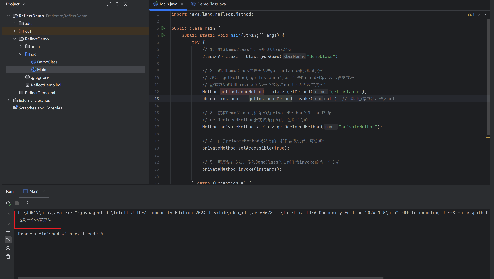

# 反射

## 1.反射概述

Java反射（Reflection）是Java语言的一个强大特性，它允许程序在运行时检查或修改类的行为。通过反射，程序可以访问类的属性和方法，即使这些属性和方法在编译时是不可知的。这主要用于开发框架、调试程序以及实现某些高级功能，如动态代理等。

## 2.反射的主要用途

1. **在运行时分析类**：可以获取类的信息，如类的成员变量、方法、构造函数等。
2. **在运行时检查对象**：可以调用对象的方法，访问对象的属性（即使这些方法和属性是私有的）。
3. **实现通用数组操作代码**：通过反射可以创建和操作数组。
4. **动态代理**：在运行时动态地创建接口的代理实例。

## 3.反射机制的基本类

- `java.lang.Class`：代表类本身的信息。
- `java.lang.reflect.Method`：代表类的方法。
- `java.lang.reflect.Field`：代表类的成员变量。
- `java.lang.reflect.Constructor`：代表类的构造器。

下面通过一个简单的Demo来演示一下如何通过反射机制来调用一个类中的私有方法

我们先新建一个DemoClass，并为其写一个私有方法

```java
public class DemoClass {
    private void privateMethod() {
        System.out.println("这是一个私有方法");
    }

    // 提供一个公共方法来获取DemoClass的实例，以便后续反射调用
    public static DemoClass getInstance() {
        return new DemoClass();
    }
}
```

随后我们通过反射在主类中调用这个类中的私有方法

```java
import java.lang.reflect.Method;

public class Main {
    public static void main(String[] args) {
        try {
            // 1. 加载DemoClass类并获取其Class对象  
            Class<?> clazz = Class.forName("DemoClass");

            // 2. 调用DemoClass的静态方法getInstance来获取其实例  
            // 注意：getMethod("getInstance")返回的是Method对象，表示静态方法  
            // 静态方法调用时invoke的第一个参数是null（因为没有实例）  
            Method getInstanceMethod = clazz.getMethod("getInstance");
            Object instance = getInstanceMethod.invoke(null); // 调用静态方法，传入null  

            // 3. 获取DemoClass的私有方法privateMethod的Method对象  
            // getDeclaredMethod会获取所有方法，包括私有的  
            Method privateMethod = clazz.getDeclaredMethod("privateMethod");

            // 4. 由于privateMethod是私有的，我们需要设置其可访问性  
            privateMethod.setAccessible(true);

            // 5. 调用私有方法，传入DemoClass的实例作为invoke的第一个参数  
            privateMethod.invoke(instance);

        } catch (Exception e) {
            e.printStackTrace();
        }
    }
}

```

这里顺便展开讲讲泛型，我们在获取DemoClass类的对象时用到了`Class<?>` ，这是一个泛型表达式，它表示 `Class` 类型的未知具体类的引用。`Class` 是 Java 反射机制的入口点，它代表了类的本身信息以及类的元数据。`?` 是通配符，表示未知的类型，因此 `Class<?>` 可以被看作是任何具体类的 `Class` 对象的引用。使用通配符 `?` 而不是具体的类型参数，是因为在这个上下文（即反射调用过程）中，我们可能不知道（或者不关心）具体的类类型是什么，我们只是想要获取这个类的 `Class` 对象。

反射调用的结果如下图



从这个Demo中我们也可以大致一窥反射机制原理，即正常情况下我们在代码中调用一个类的方法是通过对象名。方法名 () 的方式，但反射可以在运行时根据类名动态地找到并调用这个方法，就好像在一个装满各种工具（类）的盒子里，不用事先知道每个工具怎么用，在需要的时候通过一些线索（类名、方法名等）就能把工具找出来并使用。

从上面这个Demo，我们来引入学习一些反射的基本使用方法。

## 4.反射的基本API

我们还是以上面的代码Demo为例，逐步展开讲使用到的API和方法：通常来讲，反射调用需要获得一个类的对象，构造函数，方法，以及成员变量，我们按照顺序一个一个讲：

### 4.1.获取Class对象

在反射调用过程中，首先需要获取Class对象，Class对象是对一个类（包括接口、枚举、注解类型等）在运行时的抽象表示。它就像是一个类的 “镜子”，可以让你在程序运行的时候获取关于这个类的各种信息，比如类的名称、属性、方法和构造函数等，并且可以通过这个对象来动态地创建类的实例、调用类的方法等操作。每个类在 Java 虚拟机（JVM）中都有且只有一个`Class`对象与之对应，这个对象是由 JVM 在类加载的时候自动创建的。

常见获取Class对象的手段有三种：

- **利用对象的`getClass()`方法**
    
    如果你已经有了一个类的实例对象，那么可以通过这个对象的`getClass()`方法来获取对应的`Class`对象。例如，有一个`Person`类的实例`p`，可以使用`p.getClass()`来获取`Person`类的`Class`对象。这种方式在你已经有了具体的对象，并且想要获取这个对象所属类的`Class`对象时很有用。
    
- **利用类的字面常量，如`DemoClass.class`**
    
    对于已知的类，可以直接使用类名加上`.class`来获取`Class`对象。例如，`Person.class`就可以直接获取`Person`类的`Class`对象。这种方式的优点是简单直接，而且在编译时就可以确定`Class`对象，不需要先创建类的实例。例如，在一些静态方法中，当你需要获取某个类的信息，但是又没有这个类的实例时，就可以使用这种方式。
    
- **通过`Class.forName("完整的类名")`方法**
    
    这是一种动态加载类的方式，它接受一个字符串参数，这个参数是类的全限定名（包括包名）。例如，`Class.forName("com.example.Person")`可以获取`com.example.Person`这个类的`Class`对象。这种方式的强大之处在于可以在运行时根据字符串来加载类，这对于实现一些插件系统、动态配置加载等场景非常有用。例如，在一个插件框架中，插件的类名可以存储在配置文件中，通过读取配置文件中的类名，使用`Class.forName()`方法加载插件类的`Class`对象，进而可以实例化插件并使用插件提供的功能。
    

我们前文的代码Demo中使用了第三种方法，即`Class<?> clazz = Class.*forName*("DemoClass");`

```java
Class<?> clazz = Class.forName("DemoClass");
DemoClass demoClass = new DemoClass();
System.out.println(demoClass.getClass());
System.out.println(DemoClass.class);
System.out.println(clazz);
```

我们把以上三种方法放在一起，输出如下：


### 4.2.获取构造函数

通过上一小节我们已经了解到，我们在获取到一个类的Class对象后，便可以获取到对应的类的构造方法，成员变量，方法等属性。同样的我们也知道，一个类在被实例化为对象时，实际上就是调用了对应类的构造方法，所以很顺理成章的，反射调用的第二步，就是获取类的构造方法。

```java
Constructor<?> constructor = clazz.getConstructor();
```

有了构造方法，我们当然就可以通过这个构造方法实例化这个类

```java
Object o = constructor.newInstance();
```

有关Constructor类和Object类其实还有很多可以说道之处，但那并不是我们学习的重点，所以我们至此点到为止即可

### 4.3.获取方法

同样的，我们在获取到Class对象后也能够获取到对应类中的方法，这里也是我们在Java安全领域学习反射的重点，我们在很多Java相关的漏洞Poc中都会发现，实际上执行系统命令等操作实现就是通过反射调用了`java.lang.Runtime`类的`exec()` 方法。

具体实现上，我们可以通过Class类提供的`getMethod()` 方法，来获取到对应类中的方法

- `getMethod`方法是`java.lang.Class`类中的一个方法，用于获取指定类中的公共方法（包括从父类继承的公共方法）。它的签名如下：
    - `public Method getMethod(String name, Class<?>... parameterTypes)`
- 其中，`name`参数是要获取的方法名称，`parameterTypes`是一个可变参数，表示方法的参数类型列表。这个方法返回一个`java.lang.reflect.Method`类型的对象，该对象代表了所获取的方法。通过这个`Method`对象，可以在运行时动态地调用对应的方法。

例如前文的Demo中，我们通过`getMethod()` 获取到了DemoClass中名为getInstance的public方法，调用这个方法发现返回了DemoClass的类对象：

```java
Method getInstanceMethod = clazz.getMethod("getInstance");
System.out.println(getInstanceMethod.invoke(null));
```


而如果我们要获取权限为private的方法，我们则需要`getDeclaredMethod()` 方法来获取，此方法可以获取到所有类中声明的方法，包括私有方法。我们获取输出并执行这个私有方法：

```java
Method privateMethod = clazz.getDeclaredMethod("privateMethod");
System.out.println(privateMethod);

// 4. 由于privateMethod是私有的，我们需要设置其可访问性
privateMethod.setAccessible(true);

// 5. 调用私有方法，传入DemoClass的实例作为invoke的第一个参数
privateMethod.invoke(o);
```


这里讲讲Method类中提供的`invoke()` 方法：`invoke()` 用于动态地调用一个方法，它的签名是：

public Object invoke(Object obj, Object... args)，其中参数obj为需要调用方法的对象，args是传递给需要调用的方法的参数，这个方法的返回值实际就是实际调用的方法的返回值。需要静态调用方法时，传入null即可（如前文中调用公有方法时）。

### 4.4.获取成员变量

同理，通过Class对象，我们也可以获取到对应类的成员变量

例如，`clazz.getField("成员变量名")`可以获取一个公共的成员变量。如果要获取私有成员变量，可以使用`clazz.getDeclaredField("成员变量名")`，不过获取私有成员变量后，需要设置`setAccessible(true)`才能访问，这是因为 Java 的访问控制机制对私有成员有限制。

获取流程和获取方法的流程类似，这里不再赘述。

## 5.反射应用

在了解完反射调用的基本流程后，我们这里简单举一个在编写漏洞payload时很常见的利用。

因为`Java.Lang.Runtime`中存在一个`exec()`方法，该方法可以执行系统命令。

我们这里还是用一个Demo来演示一下，首先新建一个Maven项目（Maven的配置在环境搭建片中有介绍）


随后导入`IOUtils` 依赖，这是一个用于简化输入输出（I/O）操作，如文件读写，网络通信，字节流操作，异常处理等操作的工具类，由于Java中的文件执行会涉及到较为复杂的字节流操作，我们这里用这个工具类来简化处理。

在pom.xml中添加如下依赖：

```xml
<dependency>
	<groupId>commons-io</groupId>
	<artifactId>commons-io</artifactId>
	<version>2.4</version>
</dependency>
```

随后打开Maven工具栏，如下图所示：


在lifecycle选项下先点击clean，再点击install：


可以看到已经自动导入了这个依赖。


随后我们回到主类中。

首先我们尝试不使用反射调用`java.lang.Runtime` 执行系统命令：

```java
package org.example;
import org.apache.commons.io.IOUtils;

import java.io.IOException;
import java.nio.charset.StandardCharsets;

public class Main {
    public static void main(String[] args) throws IOException {
        System.out.println(IOUtils.toString(Runtime.getRuntime().exec("whoami").getInputStream(), StandardCharsets.UTF_8));
    }
}
```

执行结果如下：


然后我们应用前文中反射调用的逻辑来改写一下：

```java
package org.example;
import org.apache.commons.io.IOUtils;

import java.io.IOException;
import java.io.InputStream;
import java.lang.reflect.Constructor;
import java.lang.reflect.InvocationTargetException;
import java.lang.reflect.Method;
import java.nio.charset.StandardCharsets;

public class Main {
    public static void main(String[] args) throws IOException, ClassNotFoundException, NoSuchMethodException, InvocationTargetException, InstantiationException, IllegalAccessException {
        //获取Runtime的Class对象
        Class<?> runtime = Class.forName("java.lang.Runtime");
        //获取构造方法
        Constructor<?> constructor = runtime.getDeclaredConstructor();
        constructor.setAccessible(true);
        //使用获取到的构造方法创建实例
        Object object = constructor.newInstance();
        //获取exec方法
        Method method = runtime.getMethod("exec", String.class);
        //使用exec方法执行系统命令并输出
        Process process = (Process)method.invoke(object, "whoami");
        InputStream in = process.getInputStream();
        System.out.println(IOUtils.toString(in,StandardCharsets.UTF_8));
    }
}
```

注意，这个demo运行环境改成Java 8，从Java 9开始引入了模块系统（Java Platform Module System，JPMS），对类的访问控制变得更加严格了。默认情况下，像 `java.lang.Runtime` 这样处于 `java.base` 模块中的一些内部元素（比如它的私有构造函数）是不能被外部代码随意访问的，除非相应的模块明确地 “opens”（开放）了对应的包给外部访问。

如果JDK版本≥Java 9，`constructor.setAccessible(true)` 会报错，以上代码Demo运行结果如下：


看完这个Demo，我们再回到上一节类加载器中最后那个Demo中，看一看用于执行系统命令处的代码：

```java
// 调用CMD类中的exec方法，等价于: Process process = CMD.exec("calc.exe");
            Process process = (Process) cmdClass.getMethod("exec", String.class).invoke(null, cmd);
```

事实上，这里也是使用了反射获取CMD类中的方法`exec()`，随后使用Method类提供的invoke方法执行`exec()` 

## 6.总结

（此段来自AI，信不信你们看着办）

通过学习反射，我们可以达到以下的目的：

### 6.1.理解代码结构和动态性

- **动态加载类和调用方法**：在 Java 代码审计中，反射允许审计人员理解代码如何在运行时动态地加载类和调用方法。例如，通过反射可以在运行时根据配置文件或者用户输入的类名来加载类，这增加了代码的灵活性，但也可能带来安全风险。审计人员需要了解这种机制，以便发现潜在的恶意利用场景，比如攻击者可能通过篡改配置文件中的类名来加载恶意类。
- **查看类的内部结构**：反射可以用于获取类的各种信息，包括成员变量、方法和构造函数等。这有助于审计人员深入理解代码的结构，特别是在处理复杂的对象关系和继承体系时。例如，在审计一个基于框架的大型项目时，通过反射查看框架中各种类的内部结构，可以发现一些可能被滥用的方法或者变量，这些方法或变量可能由于权限设置不当而被外部恶意访问。

### 6.2.发现安全漏洞

- **访问控制绕过**：反射机制可能会绕过正常的访问控制机制。在 Java 中，类的成员（如私有方法和变量）通常是不能被外部类直接访问的。然而，通过反射可以将这些成员的访问权限设置为可访问，这就可能导致安全漏洞。审计人员需要关注这种情况，检查代码中是否存在不合理地使用反射来访问私有成员的情况，因为这可能会被攻击者利用来获取敏感信息或者篡改对象状态。
- **反序列化漏洞关联**：在反序列化过程中，反射经常被恶意利用。当对象被反序列化时，攻击者可以通过精心构造的序列化数据，利用反射在目标系统中执行恶意代码。了解反射有助于审计人员分析反序列化相关的代码，识别可能存在的反序列化漏洞。例如，审计人员可以检查反序列化过程中是否对传入的类名进行了严格的验证，以及是否限制了通过反射创建对象的权限。

### 6.3.理解框架和库的内部工作机制

- **框架的插件和扩展机制**：许多 Java 框架（如 Spring 等）利用反射来实现插件和扩展机制。通过反射，框架可以在运行时加载和配置插件，实现灵活的功能扩展。对于代码审计人员来说，了解反射在这些框架中的应用是非常重要的。他们需要审计框架插件系统是否安全，例如，插件是否能够访问和修改不应被其访问的核心系统资源，这可能会通过反射机制实现，所以需要对反射相关的代码进行重点检查。
- **动态代理的实现**：反射在动态代理的实现中也起着关键作用。动态代理可以在运行时为其他对象创建代理对象，用于实现诸如 AOP（Aspect - Oriented Programming）等功能。在审计涉及动态代理的代码时，了解反射如何用于创建代理对象、调用被代理对象的方法等，可以帮助审计人员发现潜在的安全问题，如代理对象是否正确地限制了对被代理对象的访问权限。