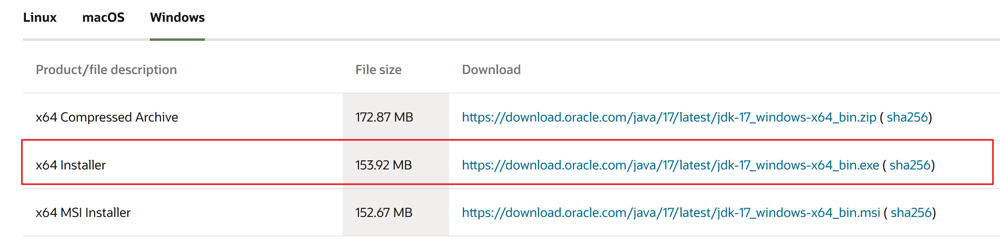
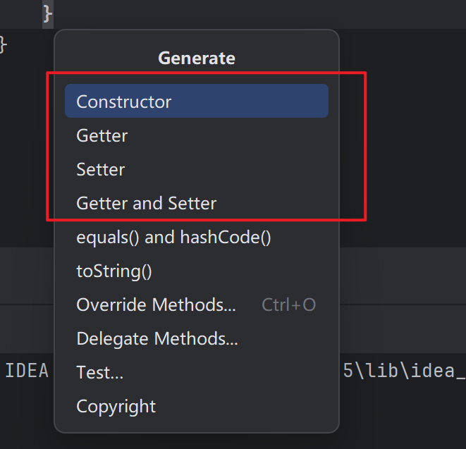

# 环境搭建篇

## 0.前言

搭建环境时，我们首先考虑到我们的目的，由于后期审计各类系统可能需要多个不同版本的java进行漏洞复现，故要考虑多个版本的JDK，这里使用一种比较原始粗暴的多版本JDK管理方式——手动切换系统windows环境变量（此方法只适用于windows）

## 1.Java多版本安装配置

我们这里先选择目前两个比较常用的java长期维护版本，Oracle JDK17和JDK11，其中一个直接下载installer即可，我这里选择的是JDK17直接安装

下载地址：[Java Downloads | Oracle](https://www.oracle.com/java/technologies/downloads/#java17)

安装过程不再赘述，一直点点点即可

JDK11选择下载压缩包，下载地址：https://www.oracle.com/cn/java/technologies/javase/jdk11-archive-downloads.html

这里需要注意的主要是解压缩和安装的位置，我是直接放在了D盘根目录，如果想要看起来规范一点也可以都放在一个路径下面统一管理

这里我们开始配置环境变量，重点理解一下为什么要这么配置，接下来就能明白为什么可以通过修改变量值来进行版本控制。

### 1.1.java环境变量配置原理

Java环境变量的配置原理主要是通过设置系统环境变量，使得操作系统能够识别并定位Java开发工具包（JDK）的安装位置。这些环境变量包括：

- **JAVA_HOME**：指向JDK的安装目录。这个变量对于许多Java应用程序和工具来说都是必需的，因为它们需要知道JDK的安装位置来找到相关的库和可执行文件。
- **PATH**：操作系统用于查找可执行文件的目录列表。将`%JAVA_HOME%\bin`（Windows）或`$JAVA_HOME/bin`（Linux/Unix）添加到PATH变量中，可以使得Java编译器（javac）和Java运行时（java）等工具在命令行中全局可用。
- **CLASSPATH**（可选）：指定Java类库的位置。然而，在现代Java开发环境中，这个变量通常不是必需的，因为Java构建工具（如Maven、Gradle）会自动处理类路径。但在某些情况下（如手动编译Java程序），你可能仍然需要设置它。

看完上面的原理我们就知道，我们目前基本都是通过ide去编译Java文件，基本不需要手动javac去编译，故我们这里选择不配置CLASSPATH，另外我们需要配置多个JAVA_HOME变量，分别指向对应的JDK安装目录，故我们的JAVA_HOME变量如下：

剩下的就只需要在Path中添加对应的JDK bin目录即可，如需要使用JDK17，就添加JAVA_HOME17的bin，JDK11以此类推，演示一下切换的效果，当前是JDK11

查看java -version

切换为JDK17

重启一下cmd，查看jave -version

多版本安装完成，后续添加其他版本JDK操作相同

## 2.IDEA安装

这里我们就选择社区版，目前阶段也是够用的，安装过程不再赘述，自己选择想要安装的路径就好，顺便可以关联一下java项目和添加一个环境变量

下载链接：[Download IntelliJ IDEA – The Leading Java and Kotlin IDE (jetbrains.com)](https://www.jetbrains.com/idea/download/?section=windows)

一些idea的小技巧：

快速生成类中的构造方法和getter，setter方法，按住alt+insert

选择想要快速生成的方法并选择想要生成的类成员即可

## 3.CodeQL安装

CodeQL是一款目前常用的代码审计分析工具，后续随着学习过程的深入我们也需要去了解并自己配置CodeQL的规则来进行更快捷的代码审计，安装过程不再赘述，参考如下链接即可

参考链接：https://www.cnblogs.com/Cl0ud/p/15803314.html

## 4.Burpsuite和配套浏览器插件

破解这里不多说，参考以下链接：

[BurpSuite v2024.7汉化无cmd框版（2024.08.08更新） - 『逆向资源区』 - 吾爱破解 - LCG - LSG |安卓破解|病毒分析|www.52pojie.cn](https://www.52pojie.cn/thread-1544866-1-1.html)

这里还是直接用吾爱破解上面大佬弄得版本，稳定好用，嫌弃不好看的可以自己下一个图标，然后新建快捷方式替换ico，直接搜索Burpsuite.ico就能搜到下载，这里放一个链接：
[Burp Suite Alt macOS BigSur - Social media & Logos Icons (icon-icons.com)](https://icon-icons.com/icon/Burp-Suite-Alt-macOS-BigSur/190318)

点上面红框然后选择自己下的ico的路径就行，建议和Burp放到一个路径下面，效果如下

浏览器这里选择firefox，插件下载比较方便，和日常其他浏览器分开用也方便查看请求包，firefox的开发者工具也够用

下载安装过程不再赘述，点点点即可，下载完成后点击扩展，选择管理扩展，搜索proxy，选择第一个安装即可

添加一个burpsuite的代理，这里也可以顺便看一看代理链相关的知识，以便后续多级代理好理解，这里8080是burp的默认监听端口，我这里也没有改

导入一个burp的证书，以便后续抓https的包，访问burp监听的端口，可以看到以下页面：

点击CA Certificate下载证书，在Firefox中进行一个证书导入，设置-》隐私与安全-》安全-》证书-》查看证书

证书颁发机构-》导入，找到刚刚下载的证书确认即可，记得勾选两个信任选项

到此Burpsuite的配置基本完成，抓个百度的包看看

成功。

## 4.Maven安装与配置

Maven是一个项目管理和构建自动化工具，主要用于Java项目。

### 4.1.安装

我们首先从官网（[Download Apache Maven – Maven](https://maven.apache.org/download.cgi)）下载Maven的二进制压缩包，Windows版本适用的版本如下图所示

随后将二进制压缩包解压到想要的路径并记住这个路径，因为后续配置环境变量需要路径为其赋值。我这里直接放到D盘根目录。

### 4.2.环境变量配置

这里环境变量的原理和前面JDK部分相似，具体不再赘述

首先在系统变量中添加一个名为M2_HOME的变量，赋值为前文中提到的Maven路径。

随后在系统Path变量中添加一个值：%M2_HOME%\bin

验证一下，打开CMD窗口执行mvn -v，出现Maven的版本信息，则说明安装配置成功

### 4.3.IDEA配置Maven

随便打开一个IDEA项目文件，找到File→Settings→Build, Execution, Deployment→ Build tools → Maven，将Maven home path设置为刚刚安装的Maven的路径，并将User setting file设置为Maven路径下conf/settings.xml，将Local resposiory设定为自己的本地依赖仓库路径，我这里放在了D盘根目录下的maven - repository（只是为了方便找到），随后保存即可

