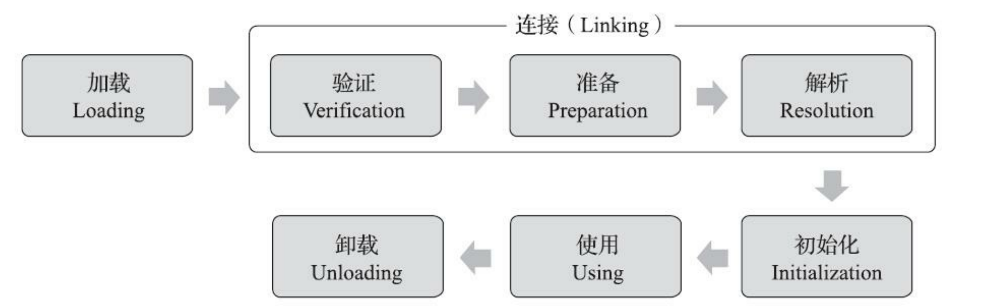

# 类加载器

参考资料：《深入理解java虚拟机》第七章，虚拟机类加载机制

在Java基础面向对象部分，我们较为深入的学习了类和对象相关的知识，描述了Class中成员变量成员方法的信息，在Java的机制中，Class中的这些信息只有被加载到虚拟机之后才能够被运行和使用，而类加载器就是Java虚拟机中的类加载机制，我们通过本部分的学习来详细了解这个机制。

## 1.类加载概述

Java虚拟机把描述类的数据从Class文件加载到内存，并对数据进行校验、转换解析和初始化，最
终形成可以被虚拟机直接使用的Java类型，这个过程被称作虚拟机的类加载机制。

与那些在编译时需要进行连接的语言不同，在Java语言里面，类型的加载、连接和初始化过程都是在程序运行期间完成的，这种策略让Java语言进行提前编译会面临额外的困难，也会让类加载时稍微增加一些性能开销，但是却为Java应用提供了极高的扩展性和灵活性，Java天生可以动态扩展的语言特性就是依赖运行期动态加载和动态连接这个特点实现的。例如，编写一个面向接口的应用程序，可以等到运行时再指定其实际的实现类，用户可以通过Java预置的或自定义类加载器，让某个本地的应用程序在运行时从网络或其他地方上加载一个二进制流作为其程序代码的一部分。这种动态组装应用的方式目前已广泛应用于Java程序之中，从最基础的Applet、JSP到相对复杂的OSGi技术，都依赖着Java语言运行期类加载才得以诞生。

## 2.类加载的过程

一个类型从被加载到虚拟机内存中开始，到卸载出内存为止，它的整个生命周期将会经历加载
（Loading）、验证（Verification）、准备（Preparation）、解析（Resolution）、初始化
（Initialization）、使用（Using）和卸载（Unloading）七个阶段，其中验证、准备、解析三个部分统称为连接（Linking）。如图所示。



我们后续大致了解一下整个类加载的过程，这里重点还是放在类加载器机制（ClassLoader）的学习中，详细的过程可以从开头提到的参考资料中去了解。

### 2.1.加载

加载是整个类加载的第一个阶段，在这个阶段，Java虚拟机主要完成以下三件事：

1. 通过一个类的全限定名来获取定义此类的二进制字节流
2. 将这个字节流所代表的静态存储结构转化为方法区的运行时数据结构
3. 在内存中生成一个代表这个类的java.lang.Class对象，作为方法区的这个类的各种数据的访问接口

关于加载的细节我们暂时不做展开，需要注意的是，类加载器正是用于这个阶段

### 2.2.验证

验证是连接的第一阶段，这一阶段的目的是保证Class文件的字节流所包含的信息符合《Java虚拟机规范》的全部约束要求，保证这些信息被当作代码运行后不会危害Java虚拟机自身的安全。

这里也不做具体展开

### 2.3.准备

准备阶段是正式为类中定义的变量（即静态变量，被static修饰的变量）分配内存并设置类变量初始值的阶段。

具体也不做展开讲

### 2.4.解析

解析阶段是Java虚拟机将常量池内的符号引用替换为直接引用的过程。那什么是符号引用，什么又是直接引用呢？

- **符号引用（Symbolic References）**：符号引用以一组符号来描述所引用的目标，符号可以是任何形式的字面量，只要使用时能无歧义地定位到目标即可。符号引用与虚拟机实现的内存布局无关，引用的目标并不一定是已经加载到虚拟机内存当中的内容。各种虚拟机实现的内存布局可以各不相同，但是它们能接受的符号引用必须都是一致的，因为符号引用的字面量形式明确定义在《Java虚拟机规范》的Class文件格式中。
- **直接引用（Direct References）**：直接引用是可以直接指向目标的指针、相对偏移量或者是一个能间接定位到目标的句柄。直接引用是和虚拟机实现的内存布局直接相关的，同一个符号引用在不同虚拟机实例上翻译出来的直接引用一般不会相同。如果有了直接引用，那引用的目标必定已经在虚拟机的内存中存在。

这部分内容实质上还是有些抽象，如果想详细了解建议还是精度前文提到的《深入了解Java虚拟机》第六章和第七章

### 2.5.初始化

类的初始化是类加载过程的最后一个步骤，之前介绍的几个类加载的动作里，除了在加载阶
段用户应用程序可以通过自定义类加载器的方式局部参与外，其余动作都完全由Java虚拟机来主导控
制。直到初始化阶段，Java虚拟机才真正开始执行类中编写的Java程序代码，将主导权移交给应用程
序。

进行准备阶段时，变量已经赋过一次系统要求的初始零值，而在初始化阶段，则会根据程序员通
过程序编码制定的主观计划去初始化类变量和其他资源。我们也可以从另外一种更直接的形式来表
达：初始化阶段就是执行类构造器<clinit>()方法的过程。<clinit>()并不是程序员在Java代码中直接编写的方法，它是Javac编译器的自动生成物，但我们非常有必要了解这个方法具体是如何产生的，以及<clinit>()方法执行过程中各种可能会影响程序运行行为的细节，这部分比起其他类加载过程贴近于普通的程序开发人员的实际工作。

具体内容我们也不做展开。

## 3.类加载器（ClassLoader）

大致的了解完类加载的整个过程，这里我们进入本章重点。

Java虚拟机设计团队有意把类加载阶段中的“通过一个类的全限定名来获取描述该类的二进制字节
流”这个动作放到Java虚拟机外部去实现，以便让应用程序自己决定如何去获取所需的类。实现这个动作的代码被称为“类加载器”（Class Loader）。

### 3.1.类加载器分类

Java的类加载器可以主要分为以下几种

1. **启动类加载器（Bootstrap ClassLoader）**：
    - 也被称为引导类加载器，是Java虚拟机（JVM）自带的类加载器，由C/C++语言实现，不继承自`java.lang.ClassLoader`。
    - 它负责加载Java的核心类库，这些类库通常位于`<JAVA_HOME>/jre/lib`目录下，如`rt.jar`（运行时环境类库）、`resources.jar`等。
    - 出于安全考虑，启动类加载器只加载包名为`java`、`javax`、`sun`等开头的类。
    - 它是扩展类加载器和应用程序类加载器的父加载器，但由于它不是Java编写的，因此没有`getParent()`方法。
    
    例如Object类的类加载器，我们用如下代码来获取查看：
    
    ```java
    public static void main(String[] args) throws Exception {
            ClassLoader classLoader = Object.class.getClassLoader();
            System.out.println(classLoader);//启动类加载器的输出为null
        }
    ```
    
2. **扩展类加载器（Extension ClassLoader）**：
    - 由Java编写，是`java.lang.ClassLoader`的子类，由`sun.misc.Launcher$ExtClassLoader`实现。
    - 它负责加载Java的扩展类库，这些类库通常位于`<JAVA_HOME>/jre/lib/ext`目录下，或者由系统属性`java.ext.dirs`指定的目录中。如图所示
    
    
    
    - 扩展类加载器的父加载器是启动类加载器。
    - 需要注意的是，随着Java模块化系统（JPMS，即Java Platform Module System，自Java 9起引入）的推出，传统的类路径（classpath）和扩展目录（extension directories）的概念逐渐被模块路径（module-path）所取代。在Java 9及更高版本中，虽然扩展类加载器仍然存在（可能以不同的形式或名称出现），但其作用和使用方式已经发生了显著变化。在Java 9及以后的版本中，推荐使用模块来组织和管理代码，而不是传统的JAR包。
    - 下面这个demo基于jdk 8来演示扩展类加载器
    
    ```java
    import sun.net.spi.nameservice.dns.DNSNameService;
    public class Main {
        public static void main(String[] args) {
            ClassLoader classLoader = DNSNameService.class.getClassLoader();
            System.out.println(classLoader);
        }
    }
    ```
    
    
    
3. **应用程序类加载器（Application ClassLoader）**：
    - 也被称为系统类加载器，是`java.lang.ClassLoader`的子类，由`sun.misc.Launcher$AppClassLoader`实现。
    - 它根据Java应用程序的类路径（`java.class.path`或`CLASSPATH`环境变量）来加载Java类。
    - 它是用户自定义类加载器的默认父加载器。
4. **用户自定义类加载器（User-Defined ClassLoader）**：
    - 开发人员可以通过继承`java.lang.ClassLoader`类来实现自己的类加载器，以满足特定的需求。
    - 自定义类加载器可以覆盖`findClass()`方法来实现自定义的类加载逻辑，而不是直接覆盖`loadClass()`方法。
    - 自定义类加载器在加载类时，通常会遵循双亲委派模型，即首先委托给父类加载器加载，如果父类加载器无法加载，再由自己加载。

### 3.3.双亲委派机制

上述我们讲到了四种类加载器，那在实际的加载过程中，四种类加载器是如何运作的呢？这里就要提到双亲委派机制。

- **原理：**除了启动类加载器，其余的类加载器都有一个自己的父类加载器，不过这里类加载器之间的父子关系一般不是以继承（Inheritance）的关系来实现的，而是通常使用
组合（Composition）关系来复用父加载器的代码。
- **工作过程**：如果一个类加载器收到了类加载的请求，它首先不会自己去尝试加载这个类，而是把这个请求委派给父类加载器去完成，每一个层次的类加载器都是如此，因此所有的加载请求最终都应该传送到最顶层的启动类加载器中，只有当父加载器反馈自己无法完成这个加载请求（它的搜索范围中没有找到所需的类）时，子加载器才会尝试自己去完成加载。
- **优点：**使用双亲委派模型来组织类加载器之间的关系，一个显而易见的好处就是Java中的类随着它的类加载器一起具备了一种带有优先级的层次关系。例如类java.lang.Object，它存放在rt.jar之中，无论哪一个类加载器要加载这个类，最终都是委派给处于模型最顶端的启动类加载器进行加载，因此Object类在程序的各种类加载器环境中都能够保证是同一个类。反之，如果没有使用双亲委派模型，都由各个类加载器自行去加载的话，如果用户自己也编写了一个名为java.lang.Object的类，并放在程序的ClassPath中，那系统中就会出现多个不同的Object类，Java类型体系中最基础的行为也就无从保证，应用程序将会变得一片混乱。如果读者有兴趣的话，可以尝试去写一个与rt.jar类库中已有类重名的Java类，将会发现它可以正常编译，但永远无法被加载运行。

如下是双亲委派机制的模型：


双亲委派模型对于保证Java程序的稳定运作极为重要，但它的实现却异常简单，用以实现双亲委
派的代码只有短短十余行，全部集中在java.lang.ClassLoader的loadClass()方法之中。

```java
protected synchronized Class<?> loadClass(String name, boolean resolve) throws ClassNotFoundException
{
    // 首先，检查请求的类是否已经被加载过了
    Class c = findLoadedClass(name);
    if (c == null) {
        try {
            if (parent != null) {
                c = parent.loadClass(name, false);
            } else {
                c = findBootstrapClassOrNull(name);
            }
        } catch (ClassNotFoundException e) {
            // 如果父类加载器抛出ClassNotFoundException
            // 说明父类加载器无法完成加载请求
        }
        if (c == null) {
            // 在父类加载器无法加载时
            // 再调用本身的findClass方法来进行类加载
            c = findClass(name);
        }
    }
    if (resolve) {
        resolveClass(c);
    }
    return c;
}
```

### 3.4.ClassLoader类方法详解

**loadClass：**

即上述的双亲委派机制实现的代码，不再赘述

**findClass：**

在编写用户自定义类加载器时，一般需要重写（override）这个方法，以下是这个方法的默认实现，可以看到不重写的话会默认抛出一个异常ClassNotFound：

```java
protected Class<?> findClass(String name) throws ClassNotFoundException {
	thrownew ClassNotFoundException(name);
}
```

我们用一个简单的demo来编写一个自定义类加载器

```java
import java.io.IOException;

public class MyClassLoader extends ClassLoader {
    private String classPath;

    public MyClassLoader(String classPath) {
        this.classPath = classPath;
    }

    @Override
    public Class<?> findClass(String name) throws ClassNotFoundException {
        try {
            byte[] classData = loadClassData(name);
            if (classData == null) {
                throw new ClassNotFoundException("Class not found: " + name);
            }
            return defineClass(name, classData, 0, classData.length);
        } catch (IOException e) {
            throw new ClassNotFoundException("Failed to load class: " + name, e);
        }
    }

    private byte[] loadClassData(String name) throws IOException {
        // 这里是加载类文件的逻辑，例如从文件系统中读取.class文件
        // 示例中省略了具体实现
        return null; // 示例返回null
    }
}
```

注意，这个示例中的 `loadClassData` 方法需要被实现以从指定的位置（如文件系统）加载类文件，并将其内容作为字节数组返回。然后，`findClass` 方法使用 `defineClass` 方法将字节码转换为 `Class` 对象。

**defineClass：**

用于将字节码数组转换成 `Class` 类的实例。这个过程是 Java 动态加载类的一个重要组成部分，允许在运行时创建新的类定义。`defineClass` 方法有多个重载版本，以下是最基本的方法实现。

```java
protected final Class<?> defineClass(String name, byte[] b, int off, int len)  
    throws ClassFormatError
```

- `name`：被定义类的全限定名（即包括包名的类名）。
- `b`：包含类数据（字节码）的字节数组。
- `off`：开始读取类数据的偏移量（即从哪个索引开始读取字节码）。
- `len`：要读取的类数据的长度（即从偏移量 `off` 开始，读取多少个字节作为类数据）。

**findLoadedClass：**

`findLoadedClass` 方法是 `java.lang.ClassLoader` 类中的一个protected方法，用于查找由该类加载器或其任何父类加载器已经加载的类。这个方法主要用于类加载器内部，帮助类加载器检查是否已经加载了某个特定的类，从而避免重复加载。

```java
protected final Class<?> findLoadedClass(String name)
```

- `name`：要查找的类的全限定名（即包括包名的类名）。
- 返回值：如果该类已被加载，则返回对应的 `Class` 对象；否则返回 `null`。

综上所述不难发现，双亲委派机制就是通过以上三个方法结合来实现的。

**过程详解：**

我们这里通过一个简单的加载自己编写的一个类`com.Classloader.TestHelloWorld`的过程，来详细解读类加载的过程：

1. `ClassLoader`会调用`public Class<?> loadClass(String name)`方法加载`com.Classloader.TestHelloWorld`类。
2. 调用`findLoadedClass`方法检查`TestHelloWorld`类是否已经初始化，如果JVM已初始化过该类则直接返回类对象。
3. 如果创建当前`ClassLoader`时传入了父类加载器(`new ClassLoader(父类加载器)`)就使用父类加载器加载`TestHelloWorld`类，否则使用JVM的`Bootstrap ClassLoader`加载。
4. 如果上一步无法加载`TestHelloWorld`类，那么调用自身的`findClass`方法尝试加载`TestHelloWorld`类。
5. 如果当前的`ClassLoader`没有重写了`findClass`方法，那么直接返回类加载失败异常。如果当前类重写了`findClass`方法并通过传入的`com.Classloader.TestHelloWorld`类名找到了对应的类字节码，那么应该调用`defineClass`方法去JVM中注册该类。
6. 如果调用loadClass的时候传入的`resolve`参数为true，那么还需要调用`resolveClass`方法链接类,默认为false。
7. 返回一个被JVM加载后的`java.lang.Class`类对象。

### 3.5.类加载器在Java安全中的应用

**URLClassLoader：**

在java.net包中，JDK提供了一个易用的类加载器URLClassLoader，它继承自ClassLoader。

`URLClassLoader`提供了加载远程资源的能力，在写漏洞利用的`payload`或者`webshell`的时候我们可以使用这个特性来加载远程的jar来实现远程的类方法调用。它的构造方法如下：

```java
public URLClassLoader(URL[] urls) 
//指定要加载的类所在的URL地址，父类加载器默认为系统类加载器。
public URLClassLoader(URL[] urls, ClassLoader parent)
//指定要加载的类所在的URL地址，并指定父类加载器。
```

我们这里通过一个简单的Demo来实现一下远程调用一个jar包，首先编写一个CMD.class

```java
import java.io.IOException;

public class CMD {
    public static Process exec(String cmd) throws IOException {
    return Runtime.getRuntime().exec(cmd);
}
}
```

把这个class编译成jar包，这里可以直接用idea来编译，参考这个链接：https://cloud.tencent.com/developer/article/1898130

然后我们用下面这个demo来远程加载这个jar包中的CMD类，URL赋值为这个jar包的地址（这里是本地地址，也可以是网络地址）

```java
import sun.net.spi.nameservice.dns.DNSNameService;

import java.io.ByteArrayOutputStream;
import java.io.InputStream;
import java.net.URL;
import java.net.URLClassLoader;

public class Main {
    public static void main(String[] args) {
        try {
            // 定义远程加载的jar路径
            URL url = new URL("file:///D://download//CMD.jar");
            // 创建URLClassLoader对象，并加载远程jar包
            URLClassLoader ucl = new URLClassLoader(new URL[]{url});
            // 定义需要执行的系统命令
            String cmd = "calc.exe";
            // 通过URLClassLoader加载远程jar包中的CMD类
            Class cmdClass = ucl.loadClass("CMD");
            // 调用CMD类中的exec方法，等价于: Process process = CMD.exec("calc.exe");
            Process process = (Process) cmdClass.getMethod("exec", String.class).invoke(null, cmd);
            // 获取命令执行结果的输入流
            InputStream in   = process.getInputStream();
            ByteArrayOutputStream baos = new ByteArrayOutputStream();
            byte[]                b    = new byte[1024];
            int                   a    = -1;
            // 读取命令执行结果
            while ((a = in.read(b)) != -1) {
                baos.write(b, 0, a);
            }
            // 输出命令执行结果
            System.out.println(baos.toString());
        } catch (Exception e) {
            e.printStackTrace();
        }
    }
}
```

运行效果，成功执行了CMD类中的方法，并传入命令行调用了calc命令：


当然，这段代码里面还要涉及后面需要学到的反射知识，这里先简单理解即可。
