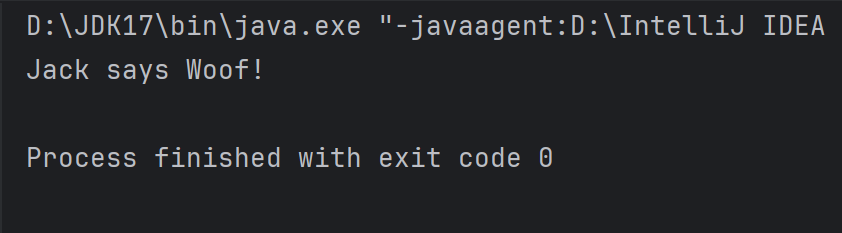

# 面向对象

面向对象是Java语言十分重要的基本特性，在学习这一特性之前，先来了解两个基本概念。

## 1.类与对象

类和对象是面向对象编程的两个基本核心概念

### 1.1.类（Class）

类是一个模板，它描述了一组具有共同属性和方法的对象。在Java中，类是创建对象的蓝图或模板。你可以将类视为一个数据类型，但它比基本数据类型（如int、double等）更复杂，因为它可以包含多个变量（称为字段或属性）和方法（定义了对象可以执行的操作）。

类的定义需要包含以下几个部分

- **类声明**：使用`class`关键字后跟类名。
- **成员变量**（字段）：定义对象的属性。
- **成员方法**：定义对象可以执行的操作。
- **构造方法**：特殊的成员方法，用于在创建对象时初始化对象。

代码示例如下：

```java
//定义一个Dog类
class Dog {
    // 成员变量  
    String name;
    int age;
    String breed;//狗的种类

    // 构造方法  
    public Dog(String name, int age, String breed) {
        this.name = name;
        this.age = age;
        this.breed = breed;
    }

    // 成员方法  
    public void bark() {
        System.out.println(name + " says Woof!");
    }

    // 另一个成员方法，展示狗的详细信息  
    public void showDetails() {
        System.out.println("Name: " + name);
        System.out.println("Age: " + age);
        System.out.println("Breed: " + breed);
    }
} 
```

### 1.2.对象（Object）

对象就是类的示例，例如我们在1.1中定义类Dog类，这个可以代指狗这个种类，而为Dog类实例化一个对象，就是将抽象的种类具体到实际的某一只狗，代码示例如下：

```java
public class Main {
    public static void main(String[] args) {
        Dog mydog  = new Dog("Jack",3,"Corgi");
        mydog.bark();
    }
}
```

实例化为mydog后，我们就得到了一只名为Jack的柯基，年龄3岁，并尝试让他叫一声



通过这两段Demo我们就可以简单地理解：类是对象的抽象，对象是类的实例化。

## 2.继承

继承也是面向对象中的核心概念，它允许我们定义一个类（称为子类或派生类）来继承另一个类（称为父类或基类）的属性和方法。通过这种方式，子类可以重用父类的代码，并且可以在此基础上添加新的特性或修改继承来的特性。下面详细解释面向对象中的继承特性：

### 2.1.继承的基本概念

- **父类（基类）**：被继承的类，包含了类所必须的一些属性和方法，如我们前面的Dog类
- **子类（派生类）**：继承自另一个类的类，它可以继承父类中的属性和方法，也可以衍生出自己的新属性和新方法，比如我们可以在Dog类的基础上衍生出警犬类，它需要在狗的基本特征上加上一些属于警犬独有的属性和方法，例如警号属性，抓犯人方法等

### 2.2.继承的好处

- **代码重用**：通过继承，子类可以重用父类的属性和方法，减少了代码的重复编写。
- **扩展性**：子类可以在继承父类的基础上，添加新的功能或修改现有功能，从而扩展了类的功能。
- **多态性基础**：继承是多态性的基础之一，多态性允许不同类的对象对同一消息作出响应。

### 2.3.继承的类型

- **单继承**：一个子类只能继承一个父类。这是大多数面向对象编程语言（如Java、C#）的标准做法。
- **多继承**：一个子类可以继承多个父类。但多继承可能导致一些复杂的问题，如“菱形问题”（Diamond Problem），因此一些语言（如Java、C#）不支持多继承，而采用接口（Interface）来实现多继承的效果。Python等语言则支持多继承。
- **多层继承**：子类继承自一个父类，而该父类本身也可能继承自另一个类，从而形成继承的层次结构。

### 2.4.继承中的方法重写（**Override**）与重载（**Overload**）

我们在语法基础部分曾提到过方法的重载，这里可以看作是第一个应用点

- **重写（Override）**：子类提供了一个特定签名的方法，该方法与父类中的某个方法具有相同的名称和参数列表，但实现不同。在子类对象上调用该方法时，会执行子类中定义的方法。比如你在定义Dog类的时候spark方法实现的狗叫是woof，你在继承这个Dog类写警犬类的时候你觉得警犬这么叫不太严肃，重新在警犬子类中写了一个新的spark方法，警犬怎么叫自己想吧我编不下去了，这就是方法的重写，是独属于类继承中的概念
- **重载（Overload）**：在同一个类中，可以有多个同名方法，只要它们的参数列表不同（参数类型、数量或顺序不同）。这与继承直接相关，因为子类可以重载从父类继承来的方法，但这并不是继承特有的概念。

### 2.5.访问控制

在面向对象编程中，通常会有访问控制机制（如public、protected、private等）来控制类成员（属性和方法）的访问权限。这些访问控制机制在继承中也扮演着重要角色，决定了子类能够访问哪些父类的成员。这也就是我们在基础部分提到的访问控制类修饰符的作用。

### 2.6.继承的注意事项

- 过度使用继承可能导致代码结构复杂，难以理解和维护。
- 继承破坏了封装性，因为子类依赖于父类的实现细节。
- 在设计类关系时，应该优先考虑组合/聚合而不是继承。

通过继承，面向对象编程提供了强大的代码复用和扩展能力，但也需要谨慎使用，以避免引入不必要的设计复杂性。

当然，talk is cheap, show me the code，我们还是通过一个代码demo来理解继承，我们就来实现一下前面说了很多次的警犬继承Dog，Dod类我们已经在前文中定义好，下面我们看看警犬类怎么写

```java
public class PoliceDog extends Dog{
    String policeNum;//警犬的警号，警犬独有的属性

    public PoliceDog(String name, int age, String breed, String policeNum) {
        super(name, age, breed);
        this.policeNum = policeNum;
    }

		//重写父类Dog的方法
    @Override
    public void bark() {
        System.out.println("发出警犬的叫声（自行想象）");
    }
    
		//警犬独有的抓犯人方法
    public void catchCriminals(){
        System.out.println("犯人已被拿下");
    }
}

```

我们来实例化一个警犬看看

```java
PoliceDog myPoliceDog = new PoliceDog("Lilly",3,"Germany Shepherd Dog","9527");
        myPoliceDog.bark();
        myPoliceDog.catchCriminals();
```

输出如下


通过这个简单的Demo，大致体现出了对象继承的一般形式和特性

## 3.封装

封装主要是将数据（属性）和操作这些数据的方法（行为）绑定在一起，形成一个密不可分的整体，也就是类（Class）。通过封装，对象的内部状态被隐藏起来，对外仅暴露有限的接口（如公有方法），这样可以减少外部对对象内部实现的依赖，增加程序的安全性、灵活性和可维护性。

### 3.1.封装的目的

1. **隐藏细节**：只向外界提供必要的信息，隐藏不需要的信息，使得类的实现细节不被外部随意访问和修改。
2. **安全性**：通过访问修饰符（如Java中的`public`、`private`、`protected`）控制对成员变量的访问，防止外部对对象的非法操作。
3. **提高代码的复用性**：封装后，可以通过继承实现代码的复用。
4. **易于维护**：封装后的代码，各个类之间的耦合度降低，易于维护和扩展。

由于我想不到Dog类怎么体现封装，我们用另外一个代码demo来说明，我们先写一个person类，代表抽象的人这个概念，同时为之添加两个成员变量姓名和年龄

```java
public class Person {
    private String name;
    private int age;

    public Person(String name, int age) {
        this.name = name;
        this.age = age;
    }

    public String getName() {
        return name;
    }

    public int getAge() {
        return age;
    }

    public void setName(String name) {
        this.name = name;
    }

    public void setAge(int age) {
        if (age <= 0 ){
            this.age = age;
        } else if (age >= 120) {
            System.out.println("世界上有这么老的人？");
        }else{
            System.out.println("年龄为负数！");
        }
    }

    public void describe() {
        System.out.println("姓名：" + name + "，年龄：" + age);
    }
}

```

在上述示例中，`Person`类封装了人的两个属性：`name`和`age`，并通过构造函数、公有方法（`setName`、`getName`、`setAge`、`getAge`、`describe`）提供了对这两个属性的访问和修改。`name`和`age`属性被声明为`private`，表示它们只能在`Person`类内部被访问和修改，从而保证了数据的封装性和安全性。通过公有方法，我们可以合法地访问和修改这些私有属性，并且还可以在方法内部添加一些额外的逻辑（如`setAge`方法中的年龄校验），以确保对象状态的一致性和正确性。
我们在主类main方法中实例化一个person，并尝试用setter，getter方法来修改和访问person的成员变量值，尝试输入一些非法值看看结果

```java
public class Main {
    public static void main(String[] args) {
        Person person = new Person("Jack",18);
        person.describe();
        person.setAge(-10);
        person.setAge(130);
        person.describe();
    }
}
```

输出如下：


## 4.接口（interface）

在讲四大特性中的多态之前，我们首先要记得，Java语言是不允许多继承的，所以要在Java语言中实现多态特性，我们要利用**接口（interface）**来实现，所以下面我们先来了解了解接口的基本概念

### 4.1.接口的定义

- **关键字**：接口使用`interface`关键字来定义。
- **组成**：接口主要包含抽象方法（在JDK 8之前）、默认方法（JDK 8引入）和静态方法（JDK 8引入），以及常量（默认使用`public static final`修饰）。
- **编译**：接口也会被编译成`.class`文件，但它并不是类，而是另一种引用数据类型。

### 4.2.接口的特性

- **抽象性**：接口中的所有方法默认都是抽象的，即方法只有声明，没有方法体（JDK 8及以后，可以通过默认方法和静态方法提供具体实现，但这些方法仍然可以被看作是接口的一部分）。
- **不可实例化**：接口不能被实例化，即不能使用`new`关键字创建接口的对象。
- **实现**：一个类可以通过`implements`关键字实现一个或多个接口，实现接口的类必须提供接口中所有抽象方法的实现（除非该类也是抽象的）。
- **多实现**：一个类可以实现多个接口，这是Java实现多重继承的一种方式（Java不支持类的多重继承，但支持接口的多实现）。
- **继承**：接口可以继承另一个或多个接口，使用`extends`关键字。

### 4.3.接口中的变量

• 接口中定义的变量默认是`public static final`的，即它们是常量，其值在接口被加载到**JVM（java**

**虚拟机）**时就已经确定，且之后不可更改。

### 4.4.接口的用途

- **定义规范**：接口定义了一组方法规范，但不提供实现，这允许不同的类以不同的方式实现这些方法。
- **实现多继承**：通过实现多个接口，一个类可以继承多个接口的行为，从而避免了Java单继承的限制。
- **解耦**：接口作为系统不同部分之间的通信契约，有助于降低系统各部分之间的耦合度，提高系统的可扩展性和可维护性。

我们这里同样用一个demo来具体看看怎么实现，这里实现一个Animal的接口

```java
public interface Animal {
    void eat();
    void sleep();

    // JDK 8 引入的默认方法
    default void walk() {
        System.out.println("Animal can walk");
    }

    // 常量
    int MAX_AGE = 100;
}

```

接着我们通过implements这个接口来实现一个Cat类（Dog类之前实现过了，懒得重写了）

```java
public class Cat implements Animal{
    @Override
    public void eat() {
        System.out.println("吃猫粮");
    }

    @Override
    public void sleep() {
        System.out.println("猫猫想怎么睡怎么睡");
    }
}
```

这里就不再去主类中实例化一个看看了，已经很浅显了。

## 5.抽象类

抽象，我们在Java中可以理解成具体的反义词，即使描述不具体的，高度概括的，所以前面提到的抽象方法就是没有具体实现方法体的方法，抽象类也可以用相同的路数来理解。

### 5.1.抽象类的概念

抽象类（Abstract Class）是Java语言中的一种特殊类，它不能被实例化，即不能使用`new`关键字来创建抽象类的对象。抽象类主要用于定义一组方法的规范，这些方法被称为抽象方法，它们只有方法的声明（包括方法名、参数列表和返回类型），而没有具体的实现（即没有方法体）。

### 5.2.抽象类的特点

1. **不能被实例化**：抽象类不能用来创建对象，它只能被用作其他类的基类（父类）。
2. **可以包含抽象方法**：抽象类中可以包含抽象方法，也可以包含非抽象方法（即实现了具体逻辑的方法）。但是，如果类中包含抽象方法，那么这个类必须被声明为抽象类。
3. **子类必须实现抽象方法**：如果子类继承了一个抽象类，并且这个抽象类中包含抽象方法，那么子类必须实现这些抽象方法，除非子类也被声明为抽象类。
4. **可以有构造方法**：抽象类可以有构造方法，这些构造方法主要用于在创建子类对象时初始化父类部分。
5. **访问修饰符**：抽象类可以使用`public`、`protected`或默认（包级别）访问修饰符，但不能使用`private`或`final`修饰符。使用`final`修饰符会阻止类被继承，这与抽象类的设计初衷相违背。

### 5.3.抽象类的用途

1. **定义规范**：抽象类可以定义一组方法的规范，这些方法在子类中可以有不同的实现。这有助于实现多态性，即不同的子类对象可以以相同的方式被调用，但执行不同的操作。
2. **实现模板方法模式**：在模板方法模式中，抽象类定义了一个算法的骨架，将一些步骤的实现延迟到子类中。这样可以在不改变算法结构的情况下，通过改变子类的行为来改变算法的具体实现。
3. **提供公共的属性和方法**：抽象类可以包含一些公共的属性和方法，这些属性和方法可以被所有子类共享。

这里用一个别人的demo来说明一下，前面写的太多了不想写了

```java
// 定义一个抽象类  
abstract class Animal {  
    // 抽象方法  
    abstract void makeSound();  
  
    // 非抽象方法  
    void eat() {  
        System.out.println("This animal eats food.");  
    }  
}  
  
// 定义一个子类，继承Animal类并实现makeSound方法  
class Dog extends Animal {  
    // 实现抽象方法  
    @Override  
    void makeSound() {  
        System.out.println("Woof!");  
    }  
}  
  
// 测试类  
public class Test {  
    public static void main(String[] args) {  
        Dog dog = new Dog();  
        dog.makeSound(); // 输出: Woof!  
        dog.eat(); // 输出: This animal eats food.  
    }  
}
```

在这个示例中，`Animal`是一个抽象类，它包含了一个抽象方法`makeSound()`和一个非抽象方法`eat()`。`Dog`类继承了`Animal`类，并实现了`makeSound()`方法。在`Test`类的`main`方法中，我们创建了一个`Dog`对象，并调用了它的`makeSound()`和`eat()`方法。由于`Dog`类实现了`Animal`类中的抽象方法，因此我们可以创建`Dog`类的对象。
至此，我们可以开始学习面向对象的剩余两大特性。

## 6.多态（Polymorphism）

多态（Polymorphism）是面向对象设计的四大基本特性之一，它允许我们以统一的接口去调用不同的对象，从而实现不同的操作。多态性增强了软件的灵活性和可扩展性。

### 6.1.多态的概念

多态性可以分为编译时多态性（也称为静态多态性或方法重载）和运行时多态性（也称为动态多态性或方法重写）。这里我们主要讨论运行时多态性。

- **运行时多态性**：主要通过方法的重写（Override）和向上转型（即子类对象引用赋值给父类类型的变量）来实现。在运行时，通过对象的实际类型来调用相应的方法。

### 6.2.多态的好处

1. **可替换性**：多态对已存在代码具有可替换性。
2. **可扩充性**：增加新的子类不影响已存在类的多态性、类库和已存在的代码，实际上新加子类更容易获得多态功能。
3. **接口性**：多态是超类通过方法签名，向子类提供一个共同接口，由子类来完善或者覆盖它而实现的。
4. **灵活性**：它在程序中体现了灵活多样的操作，提高了软件的可维护性和可扩展性。

下面还是通过一个代码示例来实现，我们用前面接口部分写好的Animal接口来进行说明

```java
public interface Animal {
    void eat();
    void sleep();

    // JDK 8 引入的默认方法
    default void walk() {
        System.out.println("Animal can walk");
    }

    // 常量
    int MAX_AGE = 100;
}

```

我们前面已经implements这个接口实现了Cat类

```java
public class Cat implements Animal{
    @Override
    public void eat() {
        System.out.println("吃猫粮");
    }

    @Override
    public void sleep() {
        System.out.println("猫猫想怎么睡怎么睡");
    }
}

```

再基于这个Animal接口实现一个别的动物，就Pig类吧

```java
public class Pig implements Animal{
    @Override
    public void eat() {
        System.out.println("猪吃猪饲料");
    }

    @Override
    public void sleep() {
        System.out.println("猪睡猪圈里");
    }
}

```

我们再去主类中实例化这两个类，并向上赋值给Animal类型变量

```java
public class Main {
    public static void main(String[] args) {
        // 向上转型：将子类的对象赋值给父类类型的变量
        Animal cat = new Cat();
        Animal pig = new Pig();

        // 调用eat和sleep方法时，在运行时确定具体调用哪个类的方法
        // 这就是多态的体现
        cat.eat();
        cat.sleep();
        pig.eat();
        pig.sleep();

        // 使用一个统一的方法处理不同的动物
        feedAnimal(cat);
        feedAnimal(pig);
    }

    // 定义一个统一处理动物的方法
    public static void feedAnimal(Animal animal){
        animal.eat();//运行时确定调用哪个eat方法
    }
}
```

在这个示例中，我们定义了一个`Animal`接口，以及两个实现了`Animal`接口的类：`Cat`和`Dog`。每个类都重写了`eat`方法，以提供各自的实现。在`TestPolymorphism`类中，我们创建了`Cat`和`Dog`的对象，并将它们分别赋值给`Animal`类型的变量。这里发生了向上转型（Upcasting），即子类对象被当作父类类型处理。然而，当调用`eat`方法时，Java虚拟机（JVM）会根据对象的实际类型（即运行时类型）来调用相应的方法，这就是多态性的体现。

最后，我们定义了一个`feedAnimal`方法，它接受一个`Animal`类型的参数。这样，我们就可以使用同一个方法来处理不同类型的动物对象，而不需要为每种类型的动物编写专门的处理代码。这大大提高了代码的复用性和可维护性。

上述代码输出如下：


## 7.抽象

抽象类，接口，以及其中的抽象方法几个大小章节中，已经对抽象的概念和实现方法有了比较详实的说明。

为了防止看漏，我们这里还是可以对抽象做一个总结：

### **7.1.抽象的概念**

在编程和更广泛的计算机科学领域，抽象是一种简化和提取关键信息以忽略不相关细节的过程。它允许我们专注于问题的核心部分，同时隐藏或忽略那些对当前问题不重要的复杂性。

### 7.2.抽象在面向对象编程中的应用

主要就是三个，**抽象类，接口，抽象方法**，前文已经有过详实的描述，这里不再赘述

### 7.3.抽象的好处

1. **代码重用**：通过定义抽象类和接口，我们可以创建一组可重用的方法规范，这些规范可以在多个类之间共享。
2. **解耦**：抽象有助于将系统的不同部分解耦，使它们可以独立地发展和演化。例如，通过定义接口，我们可以编写依赖于接口的代码，而不是依赖于具体的实现类。这样，当我们需要替换实现时，只需确保新的实现类遵循相同的接口规范即可。
3. **提高可维护性**：抽象使得代码更加模块化，易于理解和维护。当系统的某个部分需要修改时，我们只需关注与该部分相关的抽象类、接口或方法，而无需担心整个系统的其他部分。
4. **促进多态性**：抽象是实现多态性的关键。通过定义抽象类或接口，我们可以编写可以处理不同类型对象的代码，而无需关心这些对象的具体类型。这提高了代码的灵活性和可扩展性。

## 8.总结与补充

### **一、核心概念总结**

1. **对象（Object）**
    - 对象是类的实例，具有状态（属性）和行为（方法）。
    - 对象通过封装来隐藏内部状态，只通过公共方法来与外界交互。
2. **类（Class）**
    - 类是创建对象的蓝图或模板。
    - 类定义了对象的属性和方法。
3. **继承（Inheritance）**
    - 继承是面向对象编程中的一个基本特性，允许一个类（子类）继承另一个类（父类）的属性和方法。
    - 子类可以重写父类的方法，也可以添加新的属性和方法。
    - Java中每个类只能直接继承一个父类（单继承）。
4. **接口（Interface）**
    - 接口是一种引用类型，是一种抽象的类型，它是方法的集合。
    - 接口中的所有方法都是抽象的，且默认是public的。
    - 一个类可以实现多个接口，用逗号分隔。
    - 接口不能被实例化，但可以被实现（implements）或继承（在Java 8及以后版本中，接口可以继承其他接口）。
5. **抽象类（Abstract Class）**
    - 抽象类是不能被实例化的类，通常用于定义一组通用的属性和方法，这些属性和方法需要在子类中具体实现。
    - 抽象类中可以包含抽象方法和非抽象方法。
    - 如果一个类中包含抽象方法，那么这个类也必须是抽象的。

### **二、其他需要补充的内容**

1. **封装（Encapsulation）**
    - 封装是面向对象编程的三大特性之一（封装、继承、多态）。
    - 封装隐藏了对象的属性和实现细节，仅对外公开接口。
    - 通过封装，可以提高数据的安全性，减少外部对对象内部状态的直接访问。
2. **多态（Polymorphism）**
    - 多态是面向对象编程的另一个重要特性。
    - 多态允许不同类的对象对同一消息作出响应，即同一操作作用于不同的对象，可以有不同的解释，产生不同的执行结果。
    - 在Java中，多态主要通过方法重载（Overloading）和方法重写（Overriding）来实现。
3. **构造方法（Constructor）**
    - 构造方法是用于创建和初始化对象的方法。
    - 构造方法的名称必须与类名相同，且没有返回类型（连void也没有）。
    - 每个类都至少有一个构造方法，如果没有显式定义，则会自动生成一个无参的默认构造方法。
4. **访问修饰符（Access Modifiers）**
    - Java中提供了四种访问修饰符：private、default（也称为package-private）、protected和public。
    - 这些修饰符用于控制类、变量、方法和构造方法的访问权限。
5. **静态成员（Static Members）**
    - 静态成员属于类本身，而不是类的某个特定对象。
    - 静态成员可以通过类名直接访问，而无需创建类的实例。
    - 静态成员在类的所有对象之间共享。
6. **异常处理（Exception Handling）**
    - 异常处理是Java中用于处理运行时错误的一种机制。
    - Java中的异常分为检查型异常（Checked Exceptions）和非检查型异常（Unchecked Exceptions，包括运行时异常RuntimeException和错误Error）。
    - 异常处理通过try-catch-finally语句块来实现。
7. **泛型（Generics）**
    - 泛型是Java SE 5中引入的一个新特性，它提供了编译时类型安全检测机制。
    - 泛型允许在类、接口和方法中指定类型参数，这些类型参数在编译时会被替换为具体的类型。
    - 使用泛型可以减少类型转换的需要，提高代码的重用性和安全性。